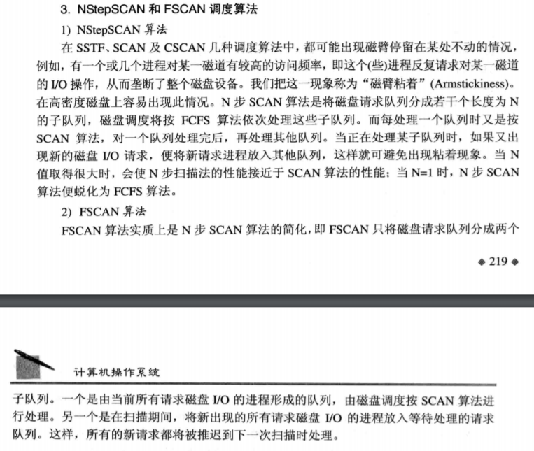

* “王道”指王道2020操作系统复习指导
* “课本”指《Operating System Concepts/操作系统概念》第七版

## 计算机系统概述

### 操作系统的基本概念

操作系统的基本特征：并发、共享、虚拟、异步。其中**并发和共享**是操作系统的两个最基本的特征。并发和并行的区别。

**操作系统提供的用户接口**：
* 命令接口：用户输入命令来调用服务
  * 联机命令接口/交互式命令接口：适用于分时或实时系统，由一组键盘操作命令组成，比如Linux的控制台。
  * 脱机命令接口/批处理命令接口：适用于批处理系统，由一组作业控制命令/作业控制语句组成。
* 程序接口：程序中调用的接口
  * 由一组系统调用命令（系统调用/广义指令）组成，用户在程序中使用系通调用命令请求操作系统服务。
* GUI图形用户界面：通过调用系统调用命令实现，严格来说不是操作系统的一部分。

### 操作系统的发展与分类

#### 手工操作阶段

此阶段无操作系统

#### 批处理阶段

出现了操作系统，脱机使用计算机。
* 单道批处理系统：内存中始终保持一道作业。
* 多道批处理系统：由多道程序设计技术支持，宏观上并行，微观上串行。

#### 分时操作系统

把处理机的运行时间分成很短的时间片，轮流分给各联机作业，每个用户感觉自己独占了计算机。

也是支持多道程序设计技术的系统，但和多道批处理系统不同，它是人机交互的。

#### 实时操作系统

在某个时间限制内能完成某些紧急任务而不需要时间片排队。
* 硬实时系统：必须在规定时间内完成。
* 软实时系统：能接受偶尔违反时间规定且不会造成任何永久性损害。

#### 网络操作系统和分布式计算机系统

#### 个人计算机操作系统

王道P13选择题16，现代操作系统都是多任务操作系统，具有**并发和并行**的特点。

### 操作系统的运行环境

用户态/目态：运行用户程序。

内核态/核心态/管态：运行内核程序，执行一些特权指令，通常包括四个方面。
* 时钟管理：提供系统时间，通过时钟中断实现进程切换。
* 中断机制
* 原语：操作系统底层的小程序，具有原子性（Atomic Operation）。
* 系统控制的数据结构及处理：系统中登记状态的数据结构及进程、存储器、设备等的管理。

#### 中断和异常

见CMU笔记的note6中Exceptional Control Flow。
* 异步异常：中断，也叫外中断，**来自CPU执行指令以外的事件，与当前处理机运行的程序无关**，如IO中断、时钟中断。
* 同步异常：也叫内中断，来自CPU执行指令内部的事件。内中断不能被屏蔽，其响应要立即进行。
  * traps：主动进行，**常用作系统调用（陷入指令/trap指令/访管指令，在用户态使用，故不可能是特权指令）**，还有特殊指令和断点等。
  * faults：非主动进行，有可能恢复，如虚拟内存的缺页、存储保护错误（访问越界）、浮点数运算错误等。
  * aborts：非主动进行，不可恢复，如非法操作码，奇偶校验错误等。

王道P20选择题9，计算机通过硬件中断机制完成用户态到核心态的转换。

### 操作系统的体系结构

大内核：将操作系统的主要功能模块作为整体运行在核心态，高性能。

微内核：将不需要在核心态执行的功能移入用户态，需要频繁切换核心态和用户态，性能不好，结构比单一内核稳定。

## 进程管理

### 进程与线程

#### 进程

Process Control Block进程控制块：描述进程的基本情况和运行态，是进程存在的唯一标志。

PCB包括：进程描述信息、进程控制和管理信息、资源分配清单、处理机相关信息/CPU现场信息。

程序段+相关数据+PCB = 进程映像/进程实体，创建和撤销进程就是创建和撤销PCB。

**进程是操作系统资源分配和调度的基本单位（除CPU外）**。

进程是动态的，程序是静态的。它们是多对多的关系，一个进程可以运行多个程序，一个程序也可以构成多个进程。**动态性**是进程最基本的特征。

**五状态**，概念和转换图：
* New创建态：申请空白PCB写入基本信息，系统分配运行必需资源。
* Ready就绪态：进程获得了除处理机以外的所有资源。
* Running运行态：正在处理机上运行。
* Waiting阻塞态/等待态：等待输入输出或其他事件。
* Terminated结束态：进程要结束运行时，要先被置为结束态，再进一步释放和回收资源。

进程控制：用到的程序叫**原语** —— 由内核提供，执行期间不允许中断。
* 进程创建：创建原语的内容。
* 进程终止：撤销原语/终止原语。
* 进程的阻塞和唤醒：阻塞是主动行为，阻塞原语，唤醒原语，**必须成对使用**。
* 进程切换

进程通信方式：
* 共享存储
* 消息传递
  * 直接通信：直接发送
  * 间接通信：发送给某个中间实体，信箱
* 管道通信：管道是连接读进程和写进程的共享文件，pipe文件，某一时刻只能单向传输。

#### 线程

进程的提出是为了提高并发度，线程的提出是为了减少并发的时空开销。

线程有独立id和线程控制块，有就绪、阻塞、运行三种基本状态。

**线程是CPU分配的基本单位，系统调度和分派的基本单位**。

线程实现方式（王道P37说明图）：
* 用户级线程：全部由应用程序完成，内核意识不到它的存在。
* 内核级线程：线程管理由内核完成，应用程序只有一个到内核级线程的编程接口。
* 组合方式：线程的创建、调度和同步在用户程序进行，用户级线程被映射到小于等于它个数的内核级线程上。

多线程模型：用户级线程和内核级线程的不同连接方式
* 多对一：用户级线程对操作系统不可见，内核操作仍为单线程，线程管理在用户空间进行，因而运行效率高。
* 一对一：并发能力强，但开销大。
* 多对多：n个用户级线程映射到m个内核级线程上，要求n>=m。

课本P147的4.4题：线程间共享内存（堆）和全局变量，每个线程有自己独立的寄存器和栈内存。

### 处理机调度

三级调度：
* 长程调度/作业调度/高级调度：将外存中的作业调入内存创建进程。
* 中程调度/内存调度/中级调度：为提高内存利用率和系统吞吐量，把进程调出到外存成为挂起态，当具备运行条件再调入内存成为就绪态。
* 短程调度/进程调度/低级调度：从就绪队列中选出进程分配处理机。

进程的调度和切换：调度和切换程序是操作系统的内核程序。三种不能进行调度与切换的情况：
* 处理中断的过程中
* 进程在操作系统的内核临界区中：但普通临界区可以，比如王道P63选择28，访问打印机就可以调度与切换。
* 其他需要完全屏蔽中断的原子操作过程中

进程调度的方式：
* 非剥夺调度方式/非抢占式：在当前进程完成或发生某种事件进入阻塞态时才分配处理机给其它进程。
* 剥夺调度方式/抢占式

调度准则：
* CPU利用率
* 吞吐量
* 周转时间/轮转时间：作业完成时间 - 作业提交时间，等待时间 + 运行时间
* **带权周转时间**：周转时间 / 运行时间
* 等待时间：在就绪队列的时间总和
* 响应时间：从提交请求到首次响应的时间

调度算法：
* FCFS先来先服务：不可剥夺
* SJF短作业优先：**平均等待时间最短，因而平均轮转时间最短**，有可能饥饿；可抢占也可以非抢占，抢占式SJF叫SRTF最短剩余时间优先
* 优先级调度：
  * 非抢占式优先级调度
  * 抢占式优先级调度：进程优先级分静态优先级和动态优先级两种，静态优先级在进程创建时确定，动态优先级可在运行时调整。王道P57一般的优先级顺序。
* 高响应比优先：相应比 = （等待时间 + 运行时间） / 运行时间
* 时间片轮转调度/旋转罗宾法：时间片，总选择就绪队列的第一个进程执行
* 多级反馈队列：新进程进入内存先放在第1级队列末尾，按FCFS运行时间片，若在时间片内未完成，则调入第2级队列末尾，按FCFS运行时间片...直到调入最后一级队列采用时间片轮转法完成；只有前一级队列为空，才调度此级队列运行；若有高级队列加入进程，抢占低级别队列的处理机；优先级越高，时间片越小。

### 进程同步

#### 基本概念

临界资源的访问过程：进入区 - 临界区（访问临界资源的代码段） - 退出区 - 剩余区。

同步关系：直接制约关系，如生产和使用的关系；互斥关系：间接制约关系，不能同时访问一个临界资源。

进程同步问题的要求：
* 王道：空闲让进、忙则等待、有限等待、让权等待（防止忙等待）
* 课本：互斥、前进、有限等待
* 刘宁：有空让进、无空等待、择一而入、算法可行

#### 实现互斥的基本方法

软件实现（**理解代码，代码行可以有任意的运行顺序**）：
* 单标志法：必须轮流进入，少一个程序就不行
* 双标志法先检查：可能同时进入临界区
* 双标志法后检查：有可能饥饿，while同时死循环
* Peterson算法：保证互斥，且没有饥饿

硬件实现：
* 中断屏蔽：运行时关中断
* 硬件指令：原子操作，由硬件实现，保证互斥。

#### **信号量**

由两个原语实现：wait - signal 或 P - V。

整型信号量：会忙等待。

**记录型信号量**：熟记wait和signal的代码。

* 信号量实现同步：请求资源前P，提供资源后V
* 信号量实现互斥：用PV包住互斥操作
* 信号量实现前驱关系：每个箭头间是同步关系，每个箭头用一个信号量解决。

#### 管程

管程是由一组数据以及定义在数据上的操作组成的软件模块。管程是为执行同步、互斥问题而诞生的，可以理解为它封装了信号量和同步互斥相关的操作。

管程的局部数据只能被管程的局部程序访问，即私有变量；进程只能通过调用管程内的过程访问共享数据，即公有变量只能通过调用方法访问；一次只能有一个进程在管程内执行某个内部过程。

管程里的wait操作和signal操作与前述信号量的wait和signal**都不同**，wait挂起进程，不进行判断是否应该挂起；signal恢复一个操作，但若没有被挂起的操作，signal语句就无效（王道P94选择29，P97选择47）。

#### **经典问题**

完全理解信号量设置、初始值和代码实现。

综合题方法：分析同步、互斥关系 - 代入经典模型创建信号量，确定初值 - 代码实现。

**生产者-消费者问题**：有同步关系也有互斥关系，互斥用一个mutex信号量，为了记录缓冲区大小n，需要两个信号量empty = n和full = 0实现。

**读者-写者问题**：用count记录读者数量，再用mutex保护对count的访问，用rw实现读和写的互斥，读进程优先，读进程会不断插队写进程；再加入一个w信号量，实现读写公平法。

**哲学家进餐问题**：每根筷子一个信号量，一个保护互斥访问的信号量，只有能够拿起两根筷子时再进餐。

吸烟者问题。

### 死锁

死锁：互为条件的进程发生的无限等待的状态。

死锁产生的原因：
* 系统资源的竞争
* 进程推进顺序非法

**死锁产生的条件**：
* 互斥
* 非抢占
* 占有且等待
* 循环等待

#### 死锁预防

破坏死锁产生的四个条件之一。破坏互斥不太可行，破坏循环等待的方法是采用顺序资源分配法。

#### 死锁避免

在资源分配过程中避免系统进入不安全状态。

安全状态：系统当前**存在**一个安全序列，按序列分配资源可以使每个进程都完成。不安全状态不一定会死锁，但安全状态一定不会死锁。

**银行家算法**：对一次资源请求，试探分配后用**安全性算法**判断是否能满足该请求。

#### 死锁的检测和解除

资源分配图。

死锁定理：看资源分配图是否可以完全简化，若不可以则处于死锁状态。

死锁解除的方法：
* 资源剥夺：挂起某些死锁进程，抢夺它的资源给其他的死锁进程。
* 撤销进程：撤销部分甚至全部死锁进程。
* 进程回退：让进程回退到可以避免死锁的状态，回退时**自愿**释放资源。

## 内存管理

### 内存管理的概念

#### 内存管理的基本概念

**进程运行的过程**：源代码**编译** - 若干目标模块**链接** - 装入模块**装入** - 装入内存。王道P163选择题1，C语言中的过程：源代码.cpp编译后生成.o目标模块，每个模块逻辑地址从0开始，链接后生成.exe装入模块，生成全局逻辑地址，再装载入内存生成物理地址即可运行。

程序链接的三种方式：
* 静态链接：上述过程中的对目标模块链接
* 装入时动态链接：装入内存时链接
* 运行时动态链接：执行时需要目标模块才链接

装入的三种方式：
* 绝对装入：在编译时（指宏观的编译，包括编译成汇编语言和再汇编成机器语言）产生绝对地址，程序中的逻辑地址和实际内存地址相同，只适合于单道程序环境
* 可重定位装入中的静态重定位：装入内存时分配物理地址，必须在装入时分配要求的全部内存空间，运行时不再修改
* 可重定位装入的动态重定位/动态运行时装入：在程序运行时才进行地址转换，需要重定位寄存器的支持，装入部分代码即可运行

内存保护：
* 方法一：使用上、下限寄存器
* 方法二：使用 重定位寄存器/基址寄存器 和 界地址寄存器/限长寄存器，包含最小物理地址和最大逻辑地址，使用时**先比较后做加法**。

#### 覆盖和交换

覆盖和交换是多道程序环境下用来扩充内存的两种方法。

覆盖：把用户空间分成一个固定区和若干覆盖区，把即将访问的段放入覆盖区。

交换：把进程换入换出内存，中级调度就是采用Swapping交换技术。

覆盖主要用于一个程序或进程内，交换用于进程间。

#### 连续分配管理方式

单一连续分配：系统区在低地址，用户区在高地址，内存中永远只有一道程序，因此不需要内存保护，**有内部碎片无外部碎片**。

固定分区分配：把用户空间划分为固定大小的区域（分区大小可不同），每个区域只装入一道作业，**有内部碎片无外部碎片**。

动态分区分配：进程装入内存时根据大小动态建立分区，**无内部碎片有外部碎片**，可通过**紧凑/压缩**解决外部碎片。装入内存时的分配策略：
* First Fit：空闲分区按地址递增排序，选择第一个足够大小的分区
* Best Fit：空闲分区按容量递增排序
* Worst Fit/Largest Fit：空闲分区按容量递减排序
* Next Fit/邻近适应算法/循环首次适应算法：与First Fit相似，但每次从上次查找结束的位置继续寻找
* 其中，First Fit内存碎片最少且性能最好；Best Fit内存碎片最多；Worst Fit/Largest Fit性能最差

#### 非连续分配管理方式

分页式存储管理：进程以页为单位申请主存空间，**有内部碎片无外部碎片**。
* 页，页框，块的概念。
* 页表：实现页号到物理块号的地址映射，页号 + 物理块号（**页框号**）。
* **地址变换机构**：王道P156图3.9，地址变换过程由硬件自动完成，PTR页表寄存器存放页表始地址和页表长度。
* TLB快表：相联存储器，存放在cache中加速地址变换。
* 多级页表：**每一级页表中的一块最大只能是内存中的一页大小**，需多次访问内存。
* **分页是从计算机的角度出发设计的，由硬件实现，对用户透明**。

分段式存储管理：按用户进程分段，如何分段在编程时决定，**无内部碎片有外部碎片**。
* 段表：段号 + 段长 + 始地址。
* **地址变换机构**
* **分段是从用户角度出发设计的**

段页式：先分成段，段内再分页，需多次访问内存。

### 虚拟内存管理

上一节的内存管理方式属于传统存储管理，作业必须一次性全部装入内存才能运行，且任何部分都不会换出。而虚拟存储器就不需要这样。

虚拟内存**必须建立在离散分配管理方式上**，有三种实现方式：
* 请求分页
* 请求分段
* 请求段页式

一般都需要的硬件支持有：
* 内存外存
* 页表段表
* 中断机构：产生缺页中断（faults）
* 地址变换机构：逻辑地址转换成物理地址

请求分页的页面置换算法：
* OPT最佳置换算法：淘汰最长时间内不再访问的页面，不可能实现，仅参考
* FIFO：会产生物理块数增多而缺页率不减反增的现象，即Belady异常，只有FIFO会产生这个现象
* LRU最近最久未使用：淘汰最长时间内未被访问的页面（不是淘汰访问次数最少的页面，那是LFU最不经常使用算法）
* CLOCK时钟置换算法/NRU最近未使用算法：简单CLOCK看使用位；改进CLOCK看使用位和修改位。

#### 页面分配策略

驻留集：操作系统为一个进程分配的物理页框的集合。

页面分配的策略，置换指缺页时在驻留集内置换还是外置换：
* 固定分配局部置换：驻留集大小不变，因而只有局部置换不可能全局置换。
* 可变分配全局置换：驻留集大小可动态**增加**，当缺页时，操作系统为进程分配空闲物理块，调入的页就放入新块。
* 可变分配局部置换：驻留集大小可动态**增减**，缺页时先换出进程现有块，频繁缺页再增加块，且若缺页率低就减少分配的块。

调入页面的时机：
* 预调页：一次调入若干相邻页
* 请求调页：一次只调入请求的页

调入页面的外存位置，外存分为文件区和对换区，对换区IO更快：
* 有足够的对换区空间，从对换区换
* 缺少足够的对换区空间，不会被修改的从文件区调入，可能被修改的从对换区调入
* UNIX方式

Thrashing抖动/颠簸：进程用在换页上的时间多于执行时间，所有页面置换算法都有可能引起抖动。抖动是由于频繁访问的页面数大于可用的物理页帧数。

工作集：某段时间内，进程访问的页面集合（比如，工作集大小为k，则在该时刻向前的6个页面编号，再去掉重复页号，就得到工作集）。理想的页替换算法尽量选择不属于工作集的页进行替换。

**驻留集与工作集是不同的两个东西**，驻留集是物理页框，是操作系统为进程分配的页框的集合，与操作系统的页分配策略有关；而工作集是该进程要访问的页，与进程的执行有关。

虚拟内存大小的决定因素：
* 不超过内存外存之和
* 不超过地址位数能表示的最大地址空间大小
* 若只让选择一个决定因素，选择二

## 文件管理

### 文件系统基础

#### 文件的概念

自下而上的结构：数据项 - 记录 - 文件。

文件的打开：只是将文件的FCB放入内存的打开文件表中，并非将文件全部放入内存。

文件的关闭：从打开文件表中删除对应条目。

#### 文件的逻辑结构

从用户观点出发看到的文件组织形式。

* 无结构文件/流式文件：以字节为单位，访问时只能穷举搜索
* 有结构文件/纪录式文件：
  * 顺序文件：记录顺序排列，访问效率最高。N条记录的文件查找一条记录，平均要查找N / 2次
  * 索引文件：用索引表指向可以变长的记录
  * 索引顺序文件：所有记录分成若干组，为每组的第一条建立索引。N条记录分为根号N组，查找一条记录，平均查找根号N次
* 直接文件/Hash File散列文件

#### 目录结构

目录项的形式：
* FCB文件控制块：包括文件名和描述信息
* 索引节点：将文件名和描述信息分开，将描述信息放在索引节点中，目录中只存放文件名和指向索引节点的指针

目录结构：
* 单级目录结构
* 两级目录结构：第一级是主文件目录，记录用户名和相应用户文件目录位置，第二级是用户文件目录
* 多级目录结构/树形目录结构
* 无环图目录结构：在树形目录的基础上加入指向同一节点的有向边，形成有向无环图，便于文件共享

#### 文件共享

多个用户共享同一个文件，系统中只保留一个副本。

两种方式：
* 基于索引节点的共享方式/硬链接：目录项采用索引节点方式，索引节点中维护一个计数器，计数器为0时系统删除文件。
* 利用符号链实现文件共享/软链接：目录项存放LINK类型的文件，里面只包含目的文件的路径名（路径名被视为符号链）。只有文件的拥有者拥有指向索引节点的指针，其它用户只有LINK文件，符号链访问失败时删除符号链。每次都要根据路径访问，开销比硬链接大。

Linux中的硬链接和软链接见[这里](https://github.com/Sefaice/BachelorNotes/blob/master/%E6%93%8D%E4%BD%9C%E7%B3%BB%E7%BB%9F/LinuxFile.md)。

上述两种方式都是静态共享，两个进程同时操作一个文件叫动态共享。

#### 文件保护

* 访问控制：在文件和目录中维护一个 Access-Control List访问控制表
* 口令
* 密码

### 文件系统实现

#### 文件系统层次结构

王道P236图4.9

#### 目录实现

目录的实现就是为了查找：
* 线性列表
* 哈希表

#### 文件实现/文件的物理结构

这里指文件的物理结构，与上一节的文件逻辑结构区分。

文件分配的单位是**1簇/1个盘块**，不是1个扇区；对于文件中的记录，一个记录是**不能跨盘块**的，存放文件时1个盘块余下的空间只能空着。

**文件分配方式**，结合图理解（**这里的磁盘盘块号是逻辑地址**）：
* 连续分配：目录包含开始块地址和文件长度，反复增删后会产生外部碎片。
* 链接分配：没有外部碎片，增删改很方便，查只能顺序访问链表
  * 隐式链接：每一块有指向下一块的指针，目录包括文件第一块和最后一块的指针
  * 显式链接：整个磁盘有一张存放在内存的链接表，每个表项存放**对应块的下一块链接指针（盘块号）**，这个链接表也叫 File Allocation Table/FAT/文件分配表
* 索引分配：每个文件有一个索引块，表项存放**文件每一块的地址**。

**王道P240三种分配方式比较表格**。

文件存储空间管理：文件存储设备分成大小相同的物理块，管理空闲块
* 空闲表法：存储空间采用连续分配方式，维护空闲表，与内存动态分配类似（有bset fit、first fit等）
* 空闲链表法：空闲盘块链 或 空闲盘区链
* 位示图法：0表示空闲，1表示已分配
* 成组链接法
* FAT也可以表示空闲存储空间

### 磁盘组织与管理

结合计组，磁盘结构，磁盘访问时间。

**寻道时间与磁盘调度算法相关，旋转延迟和传输时间和磁盘转速线性相关**，且一般寻道时间由于要移动磁臂因而最长。

磁盘调度算法：
* FCFS
* SSTF最短寻道时间优先
* SCAN
* C-SCAN：不服务返回起始端的过程也计算经过的磁道数
* LOOK和C-LOOK
* NStepSCAN和FSCAN：避免磁臂黏着，FCFS也可避免（共三个）

对盘面扇区交替编号，不同盘面错位命名可以减少旋转延迟。

#### 磁盘管理

**磁盘初始化：三个步骤**，王道P265选择题18。
1. 低级格式化/物理分区：把空白磁盘分成扇区，为磁盘的每个扇区采用不同的数据结构
2. 分区：将一个或多个柱面组成分区（C盘D盘）
3. 逻辑格式化：对物理分区进行逻辑格式化，将初始文件系统存储到磁盘上
注：第二、三步是操作系统将自己的数据结构记录在磁盘上的两个步骤。

## IO管理

### IO管理概述

IO设备，按信息交换的单位分类：
* 块设备：有结构设备，传输速率高，可寻址，可随机访问
* 字符设备：无结构设备，传输速率低，不可寻址，输入输出时常采用中断方式

IO控制方式：四种，见计组。

### IO核心子系统

IO核心子系统的概念：IO设备种类繁多，功能和传输速率差异大，因而有不同的控制方法，这些方法就组成了**操作系统内核**的IO子系统，它提供的服务主要有IO调度、缓冲与高速缓存、设备分配与回收、假脱机、设备保护和差错处理等。

#### IO调度

IO调度就是确定一个好的顺序执行IO请求。

操作系统为每个设备维护一个请求队列来实现调度，磁盘调度算法就是一种IO调度。

#### 高速缓存与缓冲区

**理解：引入高速缓存和缓冲区主要为了解决IO与CPU速度不匹配的问题**。

磁盘高速缓存：内存中暂存磁盘中的盘块，可以在内存中开辟单独的存储空间，也可以使用未利用的内存空间作为缓冲池。

缓冲区：可以采用硬件缓冲器，也可以采用**内存中的缓冲区（常用）**。缓冲区非空时不能冲入数据，缓冲区冲满后才能传出。

缓冲区的类型：
* 单缓冲：设备和处理机之间一个缓冲区。设备把一块冲入缓冲区时间为T，操作系统读出时间为M，CPU处理时间为C，平均每块用时为`max(C, T) + M`（书上图）。
* 双缓冲：一个缓冲区冲满后处理机读，外设冲入另一个缓冲区。时间为`max(C + M, T)`。
* 循环缓冲：多个缓冲区用链表形式相连成环，两个指针指向读和写的第一个缓冲区。
* 缓冲池：由多个系统公用的缓冲区组成，分成三个队列：空缓冲队列、输入队列、输出队列。由于是共享缓冲，便于并发进程使用。

高速缓存和缓冲区的对比：王道P290表5.1。

#### 设备分配与回收

按使用方式的设备分类：
* 独占设备
* 分时共享设备
* SPOOLing方式设备/虚拟设备

设备分配的数据结构：DCT、COCT、CHCT、SDT。

设备分配的过程：分配设备 - 分配控制器 - 分配通道。因此访问数据结构的顺序为：SDT - DCT - COCT - CHCT。

设备分配方式：
* 静态分配：用户作业执行前系统一次性分配，主要对于独占设备。
* 动态分配：进程执行中根据执行需要进行，多用于共享设备。

设备分配的安全性——为防止死锁：
* 安全分配方式：进程发出IO请求后就进入阻塞态。
* 不安全分配方式：进程发出IO请求后继续运行，仅当所请求设备被占用才进入阻塞态。

逻辑设备到物理设备的映射：LUT逻辑设备表。

#### SPOOLing技术/假脱机技术

将独占设备改造成**共享设备**，改造后也属于**虚拟设备**，将设备上的IO数据先存放在磁盘中。以空间换时间。

输入井和输出井：磁盘上的存储区，暂存IO数据。

输入缓冲区和输出缓冲区：内存上的缓冲区。

输入过程：输入设备 - 输入缓冲区 - 输入井，CPU需要输入数据时，从输入井读入。

输出过程：内存 - 输出井，外设空闲时，从输出缓冲区 - 输出设备。

## 整理

* **以空间换时间的机制**：cache，SPOOLING技术，通道
* **以时间换空间的机制**：虚拟存储，覆盖与交换