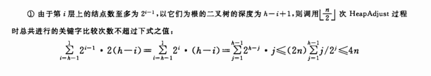

* “王道”指王道2020数据结构复习指导

## 绪论

区分**数据的逻辑结构和存储结构**。

逻辑结构：
* 线性结构：
  * 一般线性表
  * 受限线性表：栈、队列
  * 线性表推广：数组、广义表
* 非线性结构：
  * 集合
  * 树形结构
  * 图或网

存储结构/物理结构：
* 顺序存储
* 链式存储
* 索引存储
* 散列存储/哈希

时间复杂度：算法中基本语句（最内层循环语句）执行次数的数量级，O表示数量级。

空间复杂度：算法消耗的辅助空间的数量级，O(1)表示算法原地工作，指算法需要的辅助空间为常量。

**分析时间复杂度的方法**：
* 若循环主体中的变量参与循环条件的判断：将变量代入循环条件计算
* 若循环主题变量与循环条件无关：
  * 程序是递归的：递推
  * 程序非递归：累次求和

## 线性表

### 线性表的定义和基本操作

线性表是具有相同数据类型n个元素的**有限**序列。线性表中元素有先后顺序。

### 线性表的顺序表示

即线性表这个逻辑结构的顺序存储方式，又叫顺序表。即数组。

基本操作：
* 插入：将所有后面元素向后移，平均时间复杂度为`O(n)`
* 删除：平均时间复杂度`O(n)`
* 按值查找/顺序查找：平均时间复杂度`O(n)`

**CODING**：王道2.2的3，8，11，12，13。

### 线性表的链式表示

头指针和头结点：头结点让对链表所有结点的操作统一，而头指针在有头结点时指向头结点，没有头结点时指向第一个数据结点。

单链表基本操作：
* 创建链表：头插法或尾插法，时间复杂度都是`O(n)`
* 按序号查找：即访问第i个结点，时间复杂度`O(n)`
* 按值查找：时间复杂度`O(n)`
* 插入：若不包含查找（给定插入位置的前一结点指针），时间复杂度`O(1)`
* 删除：若不包含查找，时间复杂度`O(1)`。另，若给定一结点指针要删除它，不必从头查找它的前一结点，可通过复制后一结点值再删除后一结点实现。

双链表。

循环链表。

静态链表：用数组描述链表，结点的next字段存储的是下一结点的数组下标。

顺序或链式存储的查找时，要区分**按值查找**和**按序号查找**（王道p34）。

**CODING**：王道2.3的5，22。

## 栈和队列

首先，栈和队列属于逻辑结构中的线性表。

### 栈

栈的实现：
* 顺序存储结构：
  * 顺序栈
  * 共享栈：两个栈底分别在共享空间的两端，当栈顶指针相邻时栈满，可以降低上溢可能。
* 链式存储结构

**Catlan卡特兰数**：n个元素以固定顺序进栈，进栈过程中可以出栈，共有不同出栈序列的个数为

```
C(2n, n) / (n + 1)
```

采用分治递归的思想，设第k个元素固定在第k位出栈，它分割前后两组元素的顺序个数也分别独立是卡特兰数。王道p63选择11，25。

### 队列

队头：删除元素的一端；队尾：插入元素的一端。注意是从队尾入队的。

队列的顺序存储：可能出现**上溢出**，数组中仍有空间但两个指针都指向数组末尾。为避免上溢出的缺点，引入了循环队列。

#### **循环队列**

循环队列的关键操作的描述按照王道来，但考题会很严格地给出，不一定按王道。

初始状态：`Q.front = Q.rear = 0`

队列长度：`(Q.rear - Q.front + MaxSize) % MaxSize`

出队入队：`Q.rear = (Q.rear + 1) % MaxSize; //入队 Q.front = (Q.front + 1) % MaxSize // 出队`，两个指针都按顺时针方向进1。

判断队空：`Q.front == Q.rear`，即两个指针重合。

判断队满：初始时队列为空，两个指针重合，入队rear指针加1，指向队尾元素的下一位置，出队front指针加1，指向队首元素。为区分`Q.front == Q.rear`代表队空还是队满，有三种方式：
1. 牺牲一个单元。队满条件`(Q.rear + 1) % MaxSize == Q.front`
2. 增加记录元素个数的变量。队满条件`Q.size == MaxSize`
3. 增加tag变量。删除元素时tag为0，插入元素tag为1，队满条件`Q.front == Q.rear && tag == 1`

队列的链式存储。

双端队列：两端都可以入队和出队的队列。输入序列1234，输入受限的双端队列不能得到的输出序列是（4231，4213），输出受限的双端队列不能得到的输出序列是（4231，4132）。

**CODING**：王道3.2的3。

### 栈和队列的应用

**表达式运算**。

**后缀表达式转中缀表达式/后缀表达式运算**：
* 一个操作数栈
* 从前往后扫描后缀序列
* 遇到操作数入栈
* 遇到操作符op时，从栈中弹出两个操作数Y和X，组成新数X op Y入栈
* 最后栈顶就是运算结果

**中缀表达式转后缀表达式**：

方法一：
* 一个操作符栈
* 从前往后扫描中缀序列，操作数直接输出，操作符入栈
* 操作符入栈时，弹出栈中同级或高级操作符，直到碰到低级操作符为止，再将该操作符入栈
* `(`直接入栈，只有`)`能弹出它，且`)`入栈时弹出到第一个遇到的`(`之间的所有操作符

方法二：
* 将所有运算按优先级加上括号
* 再将操作符移到每组括号之后
* 去掉括号，得到结果

**中缀表达式运算算法/两个栈的表达式求值算法**（其实和中缀转后缀的方法一规则一样）：
* 两个栈，操作数栈和操作符栈
* 从前往后扫描中缀序列，操作数直接入栈
* 操作符入栈时，弹出栈中同级或高级操作符，并对每个操作符运算（从操作数栈中弹出两个操作数运算后入操作数栈），直到碰到低级操作符为止，再将该操作符入栈
* `(`直接入栈，只有`)`能弹出它，且`)`入栈时弹出到第一个遇到的`(`之间的所有操作符并同上进行运算
* 序列扫描完毕后，不断弹出操作符运算直到结束
* **时间复杂度`O(n)`**
* [参考](https://mp.weixin.qq.com/s?__biz=MjM5ODYxMDA5OQ==&mid=2651962141&idx=1&sn=b089acccefc9e55098833cdc4e95d07f&chksm=bd2d0ec18a5a87d72cd0b72180eb3b433634fb1c2af0db0cd37687135a20bf839525976b8e71&mpshare=1&scene=1&srcid=0423hoFUpZXU8ykhtFB4ek4f#rd)

王道p89选择11，可以用不同的算法运算这个表达式，观察栈的状态。

**CODING**：王道3.3的3。

### 特殊矩阵的压缩存储

对称矩阵：只存放上三角/下三角部分的元素。

三角矩阵：上三角区/下三角区的元素值为同一常量，存储时存储完上/下三角区的元素后，在最后一位存储该常量。

三对角矩阵/带状矩阵：只有中间三条对角线，其余元素为0。

稀疏矩阵：将非零元素的行列坐标和值构成三元组存储，会丢失随机存取特性。

## 树与二叉树

树也是一种逻辑结构。

### 树的基本概念

度：树中一个结点的子结点个数。树中所有结点度数的最大值是树的度。

路径：树中两个结点间所经过的结点序列，所经过的边的个数是路径长度。由于树的分支是有向的，从双亲结点指向孩子节点，因此树中的路径也只能是从上到下的，子结点之间不存在路径。

王道p107：总和总结点数的关系。

### 二叉树的基本概念

特殊的二叉树：
* 满二叉树：每一层都是满的，即都有最大结点个数。
* 完全二叉树：
  * 定义：对于深度为K的，有n个结点的二叉树，当且仅当其每一个结点都与深度为K的满二叉树中编号从1至n的结点一一对应时称之为完全二叉树
  * 叶结点只可能在最大两层出现，且最大层次的叶结点都依次排列在最左边
  * 若有度为1的结点，只能有1个，且该结点之后序号的结点都是叶结点，此时总结点数为偶数，叶结点数与非叶结点数相同
* 二叉排序树：左子树上所有结点的关键字都小于根结点，右子树上所有结点都大于根结点，左右子树也都是二叉排序树。
* 平衡二叉树：树上任一结点的左子树和右子树的深度之差不超过1的**二叉排序树**，后面应用有详细讲解。

二叉树的性质（理解）：
* 非空二叉树叶结点个数 = 度为2结点个数 + 1
* 有n个结点的完全二叉树的高度为`ceil(log2(n + 1))`或`floor(log2(n)) + 1`

二叉树的存储结构：
* 顺序存储：对完全二叉树和满二叉树比较合适，对一般二叉树，若也想让下标反应逻辑关系，需要添加空结点
* 链式存储：有n个结点的二叉链表中空链域为n + 1个

### 二叉树的遍历和线索二叉树

PreOrder先序遍历，InOrder中序遍历，PostOrder后序遍历，时间复杂度都是`O(n)`，空间复杂度为递归栈的深度，最坏情况下为`O(n)`。

层次遍历，借助队列。

**由先序/后序/层次遍历序列+中序遍历序列可以唯一确定二叉树**。

线索二叉树：是一种**存储结构**。结点结构中多了两个标志位，当结点无左子树时，ltag = 1，lchild指向该结点的直接前驱，直接后继的rtag、rchild规则相同。

线索二叉树的构造就是按某一遍历顺序，在遍历时填充结点结构中的空指针域。

**线索二叉树的遍历**是按线索访问线索二叉树，和构造不同。先序线索树和中序线索树可以不借助栈实现二叉树遍历，但是后序线索树必须要借助栈才能遍历二叉树（有可能找不到直接后继，王道p125的29，31题）。

**CODING**：王道4.3，p118中序遍历的非递归算法，p119层次遍历，课后题3非递归后序遍历求路径算法1，课后15，课后20。

### 树、森林

树的存储结构：
* 双亲表示法：数组存储，每个元素有两个字段，值和双亲结点的伪指针。
* 孩子表示法：每个结点有一个孩子结点的单链表。
* 孩子兄弟表示法：以二叉链表存储，结点中有指向第一个孩子节点和下一个兄弟结点的指针。

树转换为二叉树：左孩子右兄弟，因此二叉链表表示的树有唯一对应的二叉树。

森林转换为二叉树：先将森林中每一棵树转换为二叉树（此时每棵二叉树的根结点都没有右子树），然后将第一棵树树的根作为转换后二叉树的根，第二棵树作为其右子树，第三棵树作为其右子树的右子树...

二叉树转换为森林：即森林转换为二叉树的逆过程，拆成没有右子树的二叉树，将二叉树的根和左子树作为第一棵树，根的右子树也将其根和左子树作为一棵树...二叉树转换为树和森林是唯一的。

树的遍历：
* 先根遍历：
  * 先访问根结点，再从左到右遍历根结点的每棵子树。
  * 访问顺序与这棵树对应的二叉树的先序遍历顺序相同。
* 后根遍历：
  * 先从左到右顺序遍历根结点的每棵子树，再访问根结点。
  * 访问顺序与对应二叉树的**中序遍历**相同（注意不是后序遍历，举例看一下即知）。

森林的遍历：
* 先序遍历：
  * 先访问森林中第一棵树的根结点，再先序遍历第一棵树根结点的子树森林，再先序遍历剩下树组成的森林。
  * 对应二叉树的先序遍历。
* 中序遍历：
  * 先中序遍历第一棵树根结点的子树森林，再访问第一棵树的根结点，再中序遍历剩下的树组成的森林。
  * 对应二叉树的中序遍历。

并查集：一种集合的表示，常用树/森林的**双亲表示法**作为其存储结构，将数组下标作为元素名，字段内容为双亲结点的下表，根结点的双亲结点为负。

查并集的基本操作：
* Initial：数组内容全初始化为-1
* Find：从x开始向前找双亲结点，直到找到值为负的就是根结点
* Union：合并集合，将一个集合的根结点的指针指向另一个集合的根结点即可。

### 树与二叉树的应用

#### 二叉排序树

定义：左子树所有结点都小于根结点，右子树所有结点都大于根结点，且左右子树也分别是二叉排序树。

基本操作：
* 查找
* 插入
* 构造：依次执行插入
* 删除：有几种情况
  * 删除叶结点：直接删除
  * 删除结点只有左/右子树：让子树代替该结点
  * 删除节点有左、右两棵子树：用该结点的**直接后继或直接前驱**替代它，并删掉这个替代的结点（也就是用顺序排列中该结点的紧邻前后结点替代它）

#### 平衡二叉树

定义：任意结点左右子树的高度差的绝对值不超过1的**二叉排序树**。也叫AVL平衡树。

**平衡因子**：结点左子树和右子树的高度差为该结点的平衡因子。由定义，平衡二叉树每个结点的平衡因子只能是-1、0或1。

理解定义，平衡因子的绝对值不能超过1，但叶子结点的最大深度差可以超过1。

构造h层平衡二叉树所需的最小结点数的递推公式：`C(h) = C(h-1) + C(h-2) + 1`其中`C(1) = 1, C(2) = 2`。思想：新建一个根结点，连接h-1层和h-2层两棵平衡二叉树，得到h层平衡二叉树。（王道p166的13，17）

**平衡二叉树插入**：若插入导致了不平衡，找到**插入路径上离插入结点最近的不平衡结点A**，对**以A为根的子树**进行如下四种之一的操作：
* LL平衡旋转/右单旋转：在A的左孩子的左子树上插入，向右旋转一次。
* RR平衡旋转/左单旋转：在A的右孩子的右子树上插入，向左旋转一次。
* LR平衡旋转/先左后右双旋转：在A的左孩子的右子树上插入，先将A左孩子为根的子树左旋转，再将A为根子树右旋转，最后A左孩子的右子树的根结点C提升到A的位置。
* RL平衡旋转/先右后左双旋转：即LR方向反过来进行两次旋转。
* 在旋转过程中还要注意**旋转到根位置结点的子结点的移动**：为保持二叉排序树的性质，一个结点向右旋转成为根结点时，它原来的右结点要移动成为旧根结点的左子结点，这在LL/RR中可能出现一次，在LR/RL中可能出现两次，且尤其要注意LR/RL中只出现一次的情况（即C只有一个左/右孩子，王道p166选择16）（其实若每次插入都进行调整，这种子结点移动的情况只会出现一次，可以在每一次调整后检查是否保持二叉排序树来验证）。

#### 哈夫曼树

权：树中节点被赋予的数值，权值。

带权路径长度：树根结点到任意结点的路径长度（经过的边数）与该结点上权值的乘积。树中所有结点的带权路径长度之和叫树的带权路径长度（WPL）。

哈夫曼树/最优二叉树：含有n个带权叶子结点的**二叉树**中，WPL最小的**二叉树**。

哈夫曼树的构造：
* 构造步骤：
  * 将n个结点每个看成一棵树
  * 选择权值和最小的两棵树组成新树，直到只有一棵树为止
* 初始结点最后都成为叶结点，非叶结点没有权值
* 构造过程中供新建了n - 1个结点，哈夫曼树共2n - 1个结点
* **哈夫曼树中没有度为1的结点**

哈夫曼编码：在哈夫曼树的路径上标0或1，是一种可变长度的前缀编码，即没有一个编码是另一个编码的前缀。

哈夫曼树的WPL是对应哈夫曼编码的二进制长度，它是总长度最短的二进制前缀编码。理解哈夫曼编码的作用，要求哈夫曼树是二叉树，对应了哈夫曼编码的二进制编码，要求哈夫曼树的WPL最小，对应了哈夫曼编码的编码长度最短。

**CODING**：王道p179。

## 图

### 图的基本概念

有向图：有向图的边称为弧，即顶点的有序对`<v, w>`，其中v是**弧尾**，w是**弧头**。

无向图。

简单图：不存在重复边，不存在顶点到自身的边，这里只讨论简单图。

完全图：
* 无向完全图：无向图中任意两个顶点之间都存在边。
* 有向完全图：有向图中任意两个顶点之间都存在两条方向相反的弧。

子图。注意顶点的子集和边的子集要配套才能构成子图。

无向图中：
* 连通：无向图中两顶点之间有路径存在，则称它们连通。
* 连通图：无向图任意两顶点连通，则该无向图是连通图。
* **连通分量**：无向图中的极大连通子图。若无向图非连通，就有多个连通分量。每个孤立的顶点也算连通分量（王道p223综合题2）

有向图中：
* 强连通：任意两点间互相都有路径，则称它们强连通。
* 强连通图：有向图任意两顶点强连通，则该有向图是强连通图。
* 强连通分量：有向图中的极大强连通子图。

**生成树**：包含全部顶点的**极小连通子图**。生成树是对**连通图**而言的。非连通图的连通分量的生成树构成了生成森林。

**极大连通子图**和**极小连通子图**：极大指边数极大，包含原连通图的所有和子图顶点有关的边；极小指边数极小，包含了能使子图连通的最少的边。

度，入度，出度。

网/带权图：边上带有权值的图。

路径：两顶点间的顶点序列，包含起止顶点。路径上边的数目称为路径长度。第一个顶点和最后一个顶点相同的路径称为回路。

简单路径：路径序列中顶点不重复出现。

距离：顶点间最短路径的长度。

### 图的存储和基本操作

邻接矩阵：
* 既可以存储有向图，也可以存储无向图。
* 顺序存储结构。
* 邻接矩阵元素规则：
  * 对于不带权值的图，矩阵中1表示有边，0表示无边
  * 对于带权图，有边就存储权值，没有边就存储∞，主对角线元素存储0（即不论有向无向，带权不带权，主对角线始终存储0）。
* 若一个图的邻接矩阵为A，则A^n的元素`A^n[i][j]`表示由顶点i到顶点j的长度为n的路径数目。

邻接表：
* 既可以存储有向图，也可以存储无向图。
* 顶点顺序存储，边链式存储。
* 对图中每一顶点建立一个依附于它的边的链表（无向图为边表，有向图为出边表），用一个数组存储顶点数据和边表的头指针。
* 对于无向图，存储空间复杂度为`O(|V| + 2|E|)`，有向图为`O(|V| + |E|)`，无向图中每条边在邻接表中出现两次。
* 邻接表存储稀疏矩阵可以大大节省空间。
* 邻接表不唯一，每个顶点的边表中结点顺序是任意的。

十字链表：
* 存储有向图。
* 顶点顺序存储，弧链式存储。
* 十字链表其实就是在邻接表的基础上增加了入弧的指针，每个顶点多了指向第一个入弧的指针域，每条边结点多了指向弧头相同的下一条弧。**手工绘制一下王道p192图5.9即明白**。
* 相比于邻接表，十字链表不仅能很快找到一个结点为弧尾的弧，也能找到以它为弧头的弧，容易求出入度和出度。
* 十字链表也不是唯一的，但是它表示的图唯一。

邻接多重表：
* 存储无向图。
* 顶点顺序存储，边链式存储。
* 和十字链表对邻接表的改进一样，每条边中多了指向下一条依附于顶点j的边的指针，**每条边在邻接多重表中只有一个结点（在邻接表中无向图的每条边有两个结点）**。
* 每条边结点同时存在于两个链表中（边两端顶点出发的边的链表），这样在遍历边或者删除某一条边的时候就不用像邻接表一样遍历整个表了。

### 图的遍历

#### Breadth First Search广度优先搜索

需要用到辅助队列，空间复杂度为`O(|V|)`；用邻接矩阵存储时的时间复杂度为`O(|V|^2)`，用邻接表存储的时间复杂度为`O(|V| + |E|)`。

单源最短路径问题：广度优先搜索可以求**无权图**的单源最短路径，但带权图不行，因为BFS没有全局信息。

广度优先生成树：存储结构不同，生成树可能不同，用邻接矩阵表示的图唯一，但由邻接表得到的BFS生成树可能不同。

#### Depth First Search深度优先搜索

需要用到递归工作栈，空间复杂度为`O(|V|)`；用邻接矩阵存储时的时间复杂度为`O(|V|^2)`，用邻接表存储的时间复杂度为`O(|V| + |E|)`。

连通图的深度优先搜索生成深度优先生成树，非连通的生成森林。

若无向图连通，一次DFS/BFS遍历就能访问所有结点，但非连通图中遍历调用DFS/BFS递归函数的次数就是连通分量个数（王道p200和p202的DFS/BFS代码）。

### 图的应用

手工模拟算法流程，步骤和算法间的区别烂熟于心。

#### 最小生成树算法

带权无向图的生成树中，权值和最小的生成树叫最小生成树（Minimum Spanning Tree, MST）。

最小生成树树形不唯一，但权值和唯一最小。

**Prim算法**

```cpp
T = {} // 初始化空树
U = {w} // 初始化顶点集合，加入任一顶点w
while U中不包图中含全部顶点
  选择权值最小的边uv，其中u∈U, v∈V-U  // 选择一端为新顶点的权值最小的边
  边uv加入T
  顶点v加入U
```

时间复杂度为`O(|V|^2)`，不依赖于边数，因此适用于求边稠密的网的最小生成树。

**Kruskal算法**

```cpp
T = V // 初始化树为只有全部顶点
E' = {} // 初始化边集为空
while E'中边的数目不足n-1（或T还不是一棵树）
  选择权值最小的边e，其中e∈E-E'，且e加入E'后不构成回路 // 选择与T不同连通分量的边
  边e加入E'和T
```

通常用堆存放边集，时间复杂度为`O(|E|log|E|)`，因此适用于边稀疏而顶点较多的网。

#### 最短路径

**Dijkstra算法**

求带权有向图的单源最短路径。

王道p214算法步骤：初始集合S只有起点，每次选择**从起点能够到达的最短路径终点**加入S，每一轮存储的是从起点到所有顶点的路径长度，再从中选择最小的。

**Dijkstra和Prim的区别**：这两个算法步骤很像，但是Prim算法每次选择最短边，Dijkstra算法每次选择从起点出发的最短路径。

时间复杂度为`O(|V|^2)`，若要求出所有顶点之间的最短路径，时间复杂度为`O(|V|^3)`。

**Floyd算法**

求带权有向图所各点间的最短路径。

初始为邻接矩阵，逐个加入图中顶点，若该顶点可以缩短路径长度，则修改矩阵。

时间复杂度为`O(|V|^3)`，也适用于不含负权回路的有负权的有向图，也适用于无向图。

#### **拓扑排序**

有向无环图：有向图中不存在回路，也叫DAG（Directed Acyclic Graph）图。

AOV（Activity on Vextex Network）网：DAG图中用**顶点**表示活动的网络。活动有前驱后继关系，而不关注活动开销，即不关注边的权值。

拓扑排序：DAG图顶点组成的序列，每个顶点出现一次，若有A-B的路径，则拓扑排序中A在B之前。

拓扑排序算法：
* 从DAG图中选择一个没有前驱的顶点输出，删除该顶点和以它为起点的有向边
* 重复直到DAG图为空或图中不存在无前驱的顶点为止，后一种情况表示图中必存在环。

拓扑排序的时间复杂度：若用邻接矩阵存储，`O(|V|^2)`；若用邻接表存储，`O(|V| + |E|)`。

若按拓扑排序结果安排顶点序号，得到DAG图的邻接矩阵是三角矩阵，即图有“有序”的拓扑排序序列，则它的邻接矩阵是三角矩阵；若一个DAG图的邻接矩阵是三角矩阵，则存在拓扑排序。

#### **关键路径**

AOE（Activity on Edge Network）网：带权有向图中用**边**表示活动的网络。顶点表示事件，边上的权值表示活动开销，注意和拓扑排序区别。

AOE网中只有一个入度为0的顶点 - 开始顶点/源点，表示整个工程的开始；只有一个出度为0的顶点 - 结束顶点/汇点，表示整个工程的结束。

AOE网中一个顶点代表的事件发生后，从该顶点出发的边才能发生；进入某一顶点的所有边表示的活动完成后，该顶点代表的事件才能发生。有些活动可以并行，当所有路径上的活动完成后，工程才能结束。

**关键路径**：从源点到汇点的所有路径中，具有最大路径长度的路径。关键路径上的活动称为**关键活动**。

关键路径长度是完成整个工程的最短时间，因此寻找关键活动，因而得到关键路径，就能得到最短完成时间。算法的变量定义和步骤在王道p218，手工模拟理解。

缩短关键路径上关键活动的执行时间可以缩短工期，若有多条关键路径，则每条关键路径上的关键活动时间都要缩短。

## 查找

### 基本概念

ASL平均查找长度：每一种查找结果关键字比较次数的平均值，一般认为每个元素的查找概率相等。查找成功的目标元素是每一个元素，而查找失败的目标元素是所有可能的目标元素类。

### 顺序查找和折半查找

#### **顺序查找**

一般线性表的顺序查找：
* 线性表中元素无序。
* 编码时引入哨兵减少判断语句，王道p240，但我认为只是编码简便了，比较次数还是那么多。
* 查找成功的ASL为`(n + 1) / 2`；查找失败时每次都要与所有元素比较，ASL为`n + 1`（使用哨兵时，不使用时为n）。

有序表的顺序查找：线性表中元素有序，构造n+1个失败结点以计算查找失败的ASL。

#### **折半查找**

仅适用于**有序的顺序表**，因为需要随机存取来定位查找区域。

判定树：一棵最佳二叉排序树。

时间复杂度为`O(log2(n))`。

ASL计算：根据判定树计算，n个查找成功的结点，n+1个失败结点。王道p246选择14，“查找失败结点的ASL不是判定树中的方形结点，而是其上层的圆形结点”，查找失败时失败结点是虚构的，只是用来表明位置，是不会计算比较次数的。

#### 分块查找/索引顺序查找

将查找表分为若干子块，块间有序，块内无序，有一个记录每块中最大关键字和块中第一个元素地址的索引表。

查找是先确定块，可以顺序查找也可以折半查找，再在块中查找元素，只能顺序查找。

分块查找ASL的计算就是两个查找步骤综合计算。

### B树和B+树

#### **B树**

B树又称多路平衡查找树，B树所有孩子结点的孩子结点数的最大值为阶，m阶B树的定义：
* 每个结点最多有`m`棵子树，最多有`m - 1`个关键字。
* 若**根结点**不是终端结点，最少含有**2**棵子树。
* 所有**非根且非叶结点**，最少有`ceil(m/2)`棵子树，最少有`ceil(m/2) - 1`个关键字。
* 结点结构为：第一个字段为结点关键字个数n，然后为两个指针夹一个关键字，关键字左侧指针所指结点的关键字都比它小，右侧都比它大。
* B树的**叶结点**定义为不带信息的结点，和ASL中的失败结点类似，实际指向它们的指针为空，所有叶结点都在同一层，**计算B树高度时不计算叶结点那一层**。
* B树的**终端结点**为最低层非叶节点。
* B树是所有结点平衡因子都等于0的多路查找树（也是一种排序树）。

B树的高度：根据定义及结点的指针限制，可以得到B树的最小高度和最大高度。

B树的查找：
* 和二叉排序树相似，依据大小选择分支。
* 先在B树中查找结点，再在结点内寻找关键字，在每个结点中若找不到关键字，就到对应指针指向的结点中查找。
* 由于B树常作为磁盘的文件索引或数据库索引，所以在B树中查找结点通常在磁盘上进行，在结点内查找在内存中进行。

**B树的插入**：
* 定位。根据B树查找步骤，找到插入位置的最底层非叶节点，B树的插入位置一定在**终端结点**中。
* 插入。若插入后的结点关键字个数大于m-1，需要进行分裂：
  * 将插入后的结点分为两个结点，中间位置结点（第`ceil(m/2)`个结点）插入父结点
  * 中间结点左侧留在原结点
  * 中间结点右侧放入新结点，中间结点插入父结点后的右侧指针指向这个新结点
  * 若插入父结点后也需要分裂，则一直分裂到满足定义为止，最后有可能使B树高度加1

**B树的删除**：
* 当所删除的关键字k**不在终端结点**中：
  * 若k左侧子结点的关键字个数**大于最小要求个数**（`ceil(m/2) - 1`），用其中的最大关键字k’代替k（k’即为k的直接前驱），再递归地删除k’
  * 若k右侧子结点的关键字个数**大于最小要求**，用k的直接后继k’代替k，再递归删除k’
  * 若以上都不满足，即k左右两侧结点的关键字个数都是`ceil(m/2) - 1`，则直接将两个子结点合并，再删除k
* 当所删除的关键字k**在终端结点**中：
  * 若该终端结点的关键字个数**大于**`ceil(m/2) - 1`，直接删除关键字
  * 若该终端结点的关键字个数**等于**`ceil(m/2) - 1`，且它的相邻兄弟结点关键字个数大于等于`ceil(m/2)`，即“**兄弟够借**”，则兄弟结点一个元素上去，父结点一个元素下来，相当于兄弟结点少了一个关键字，达到新的平衡。
  * 若该终端结点的关键字个数等于`ceil(m/2) - 1`，且它的相邻兄弟结点关键字个数等于`ceil(m/2) - 1`，即“**兄弟不够借**”，则将父结点关键字拿下到该结点，再将该结点与兄弟结点**合并**。合并有可能导致父结点关键字个数减少，这样需要继续调整父结点，最后有可能使B树高度减1。
  * 在兄弟够借和兄弟不够借同时存在时，选择哪一边操作是任意的，只是最后得到的新B树形态不同。

**在插入和删除操作中，每一步操作后都要保证B树仍是一个所有结点平衡因子为0的多叉排序树（即不会出现左右子树高度不同的情况），以此验证调整的正确性。**

#### **B+树**

m阶B+树的定义：
* 每个分支结点最多有m棵子树，**结点的子树个数与关键字个数相等**。
* 非叶根结点至少有两棵子树，其它分支结点至少有`ceil(m/2)`棵子树。
* B+树每一个非叶结点只起索引作用，只包含各子结点的最大关键字和对应指针。
* B+树**叶节点包含了所有的关键字**，非叶节点的关键字都会在叶结点出现，且每个关键字有一个指向对应记录的指针，关键字按顺序排列，**相邻叶结点互相链接**。
* B+树有**两个头指针**：一个指向根结点，一个指向关键字最小的叶结点，因此B+树支持**顺序查找**和多路查找。

B+树的查找：与B树不同，B+树每次在非叶节点查找到关键字后不会停止，直到在叶结点找到该关键字为止，因此每次查找都会到叶结点才终止。

### 散列表

#### **散列查找**

散列查找与前述查找不同，不是基于比较的查找，它的查找效率也与比较次数无关。

散列函数：把查找表中的关键字映射成对应地址的函数。

**冲突**：散列函数把两个及以上的不同关键字映射到同一地址。发生冲突的不同关键字称为**同义词**。

散列表：根据关键字直接进行访问的数据结构。理想情况下其查找效率为`O(1)`。

散列函数的构造要求（王道p269综合题2）：
* 定义域要包含全部关键字，值域依赖于散列表的地址范围。
* 散列函数映射的地址要可以访问到（不会每次访问的映射结果不一样，比如随机数），尽量等概率、均匀地分布在地址空间中。
* 映射尽量简单。

常用的散列函数：
* 直接定址法：`H(key) = a * key + b`，适用于关键字分布连续的情况。
* **除留取余法**：`H(key) = key % p`，其中p是不大于散列表长m的最大质数。
* 数字分析法：取关键字数字中均匀分布的几位作为散列地址。
* 平方取中法：取平方值的中间几位作为散列地址，最终地址与每一位都有关，适用于关键字每位都不均匀的情况。
* 折叠法：将关键字分成数位相同的几部分，再用它们的叠加和作为散列地址。

处理冲突的方法：
* 开放定址法：空闲地址既向同义词开放，又向非同义词开放，新地址为在冲突的散列地址上加一个增量序列后取余，增量序列有几种取法：
  * 线性探测法：顺序探测下一单元直到找出空闲单元。
  * 平方探测法/二次探测法：增量序列为平方序列。
  * 再散列法/双散列法：`Hi = (H(key) + i * H'(key)) % m`，H’为第二个散列函数，m为散列表表长。
  * 伪随机序列法：增量序列为一伪随机序列。
  * **使用开放定址法时，不能随意删除表中元素**，因为删除元素可能会截断其它具有相同散列地址元素的查找，在删除时可以用删除标记作逻辑删除。
* 拉链法：把所有同义词放入链表。

散列表的查找效率取决于三个因素：
* 散列函数
* 处理冲突的方法
* 装填因子α：装填因子 = 表中记录数n / 散列表长度m。**散列表的平均查找长度只依赖于装填因子α，而不直接依赖于n和m**。

**散列表平均查找次数的计算**：王道课后题，熟记不同散列表构造和处理冲突的方法，计算细心，且要防止思维定势。

### 串

模式匹配：串中子串的定位操作。子串也叫模式串。

#### **经典模式匹配算法/BF算法**

对主串中每个字符开始，与子串比较，时间复杂度为`O(mn)`。

#### **KMP算法**

思想：利用比较过的信息，每次匹配失败时不进行指针回溯。

子串的部分匹配值/next数组：每个字符的部分匹配值为它结尾的子串的**前缀**和**后缀**的**最长相等前后缀长度**。

算法步骤：
* 用两个指针i和j分别访问主串和子串
* 当出现不匹配时，将子串向后移动，`移动位数 = 已匹配字符数 - 对应的部分匹配值`，其中“对应的部分匹配值”为主串和子串目前匹配字符的最后一位的部分匹配值
* 子串j指针移动：`j = j - 移动位数`
* i不移动，子串和j移动完后i和j继续开始进行匹配检查
* 当出现不匹配且j为0时，i和j同时加1

可见算法中i和j指针不会进行回退，在不匹配出现时子串直接跳过已知匹配部分，从未知位开始检查。

算法的时间复杂度为`O(m + n)`。

## 排序

### 基本概念

算法的稳定性：经过排序后，关键字相同的元素是否保持原顺序中的相对位置不变。

### 插入排序

#### **直接插入排序**

王道的代码是从前往后遍历，再对每一元素从后往前选择位置。

**时间复杂度**`O(n^2)`，**空间复杂度**`O(1)`，**稳定**。

#### **折半插入排序**

插入排序在选择插入位置时采用折半查找，相比于直接插入排序，**只是减少了元素的比较次数**，而元素的交换次数不变，因此时间复杂度没有降低。待排序表必须是**顺序表**，才能用折半查找。

**时间复杂度**`O(n^2)`，**空间复杂度**`O(1)`，**稳定**。

#### **希尔排序**

将待排序表按步长分组进行直接插入排序，每一轮排序减小步长，最后步长为1进行直接插入排序。

**时间复杂度无法估计**，最坏情况下为`O(n^2)`，**空间复杂度**`O(1)`，**不稳定**。

### 交换排序

#### **冒泡排序**

王道中的冒泡排序代码使用flag，可以提前结束排序。

**时间复杂度**`O(n^2)`，**空间复杂度**`O(1)`，**稳定**。

#### **快速排序**

在待排序表中选择一个pivot，一趟快速排序将pivot放入它的最终位置，且使它的左侧元素都比它小，右侧元素都比它大，然后递归地对左右两侧执行第二趟快速排序...直到所有元素都在最终位置上。

快速排序的实现递归调用划分操作，而王道给出的划分函数如下：

```cpp
int Partition(Element A[], int low, int high) {
    Element pivot = A[low]; // 将表中第一个元素作为枢纽值
    while (low < high) {
        while (low < high && A[high] >= pivot) --high; // 轮流从两端找到比pivot小/大的元素进行交换
        A[low] = A[high];
        while (low < high && A[low] <= pivot) ++low;
        A[high] = A[low];
    }
    A[low] = pivot; // 交换完毕，将pivot放到最终位置
    return low; // 返回pivot最终位置
```

**时间复杂度**`O(nlog2(n))`，**空间复杂度**是递归栈的深度，平均为`O(log2(n))`，**不稳定**。**快速排序是平均性能最好的内部排序方法**。

**CODING**：王道7.3划分算法和综合题7。

### 选择排序

#### **简单选择排序**

每一趟选出最小的元素进行交换，因此简单选择排序不稳定。

**时间复杂度**`O(n^2)`，**空间复杂度**`O(1)`，**不稳定**。

#### **堆排序**

是一种树形选择排序，在排序时将待排序表**视为**一棵**完全二叉树的顺序存储结构**，即存储结构还是数组，但是用树的思想进行操作。

小顶堆（小根堆）：堆是一棵完全二叉树，树中每一个非根结点的值都大于其父结点，根结点值最小。大顶堆就是每一非根结点的值都小于其父结点，根结点值最大。

创建大根堆：
* 由于堆排序是对数组进行模拟完全二叉树操作，因此初始建堆**不是从空堆开始依次插入元素**，而是**对现有数组的树形进行调整**。
* 从n/2号结点到1号结点，依次进行向下调整。
* **向下调整**：大根堆的向下调整是，若子树根结点小于其子结点，则将它与较大的子结点交换，依次向下比较和交换，直到子树是一个大根堆。

**堆排序的步骤**：
* 每次将堆的根结点输出，再进行调整，直到输出所有结点就得到有序序列。
* 输出根结点采用堆中删除元素的方式：将根结点与最后一个结点**互换**，再删除最后一个结点，再对根结点进行**向下调整**。

堆中插入元素需要进行向上调整：插入元素在最后一个结点，对于大根堆，若结点大于其父结点，则进行交换，直到不能交换为止。

**建堆的时间复杂度**`O(n)`，**堆向上/向下调整的时间复杂度**`O(log2(n))`，**堆排序的时间复杂度**`O(nlog2(n))`，**空间复杂度**`O(1)`，**不稳定**。

堆排序建堆时的关键字比较次数不会超过4n，在严蔚敏的《数据结构》中证明如下:



### 归并排序和基数排序

#### **归并排序**

两路归并排序：将n个元素两两归并得到n/2个长为2或1的有序子表，再两两归并直到合为一个有序表。每次将所有子表两两归并称为一趟。

归并排序是递归实现的，每次递归将左右两个子表调用归并排序，最后合并子表。

两路归并排序**时间复杂度**`O(nlog2(n))`，其中每趟归并的时间复杂度为`O(n)`，共进行`O(log2(n))`次归并,**空间复杂度**`O(n)`，其中Merge函数用到了长度为n的辅助数组，递归栈深度为log2(n)，**稳定**。

#### **基数排序**

对数字的每一位依次排序，每一位排序时需要借助r个队列（十进制数r就是10），对于最大为d位的数，共要进行d次分配和收集。

**时间复杂度**`O(d * (n + r))`，**空间复杂度**`O(r)`，**稳定**。

### 排序算法的比较和应用

九个排序算法：3个插入排序（直接，折半，希尔）、2个交换排序（冒泡，快速）、2个选择排序（简单，堆）、两路归并排序、基数排序。熟练它们的**执行过程**、**时间复杂度（包括最好、平均和最坏情况）**、**空间复杂度**、**稳定性**，结合王道p325表。

九个排序中若将顺序存储改为链式存储，会降低效率的是（也就是**要求随机访问的排序方式**）：折半插入排序、希尔排序、快速排序、堆排序。

### 外部排序

内部排序：完全在内存中进行的排序。

外部排序：在排序过程中进行多次内存和外存间的交换，对外存文件中的记录排序后结果仍放入原有文件中。适用于待排序文件太大，无法一次装入内存的情况。

外部排序通常采用归并排序，一般结构为：
* 工作区大小/可用内存大小 = 初始归并段大小 = 缓冲区总大小
* 缓冲区个数 = 初始归并段占用的磁盘块数
* 归并路数 = 缓冲区个数 - 1

外部排序的时间开销主要是磁盘IO，因此提高外部排序速度，要着力减少IO次数，通常有**增大归并路数m**和**减少初始归并段个数r**两种思路。

#### 多路平衡归并与败者树

败者树：
* 是一棵二叉排序的完全二叉树，在多路归并时使用，即将多个有序的归并段合并为一个有序段时使用。
* 每一个归并段的最小元素作为败者树的叶结点，在非页结点记录左右分支比较的败者序号，根结点记录的就是第二小的元素（头号输家），每个归并段的其余元素作为替补。
* 每次输出根结点，即目前最小的结点，然后加入替补，重新选出冠军。
* 使用败者树前后一趟归并的开销计算：王道p334选择题2。使用败者树可以减少多路归并的开销，使得增大归并路数可以减少归并的比较次数。

#### 置换-选择排序（生成初始归并段）

选择-置换排序是一个从输入文件生成多个排好序的初始归并段的算法，步骤如下：
* 从输入文件读入数据到缓冲区，选出最小元素MINIMAX输出到归并段中
* 再读入一个数据，选出比MINIMAX大的最小元素作为新的MINIMAX输出
* 重复，直到所有数据处理完毕

#### 最佳归并树

哈夫曼树的一个应用。构建m叉哈夫曼树让归并所有段的**总IO次数**最小，因此每一段的记录数就是构建哈夫曼树的权值，记录越多的段在最佳归并树中离根结点越近，使总WPL最小。

当初始段数不能构成严格m叉树时，即`(n0 - 1) % (m - 1) = u`的u不为0时（m为最佳归并数的叉数，n0为初始归并段数），需要添加`m - u - 1`个长度为0的虚段，依照哈夫曼树的构建规则得到最佳归并树。
