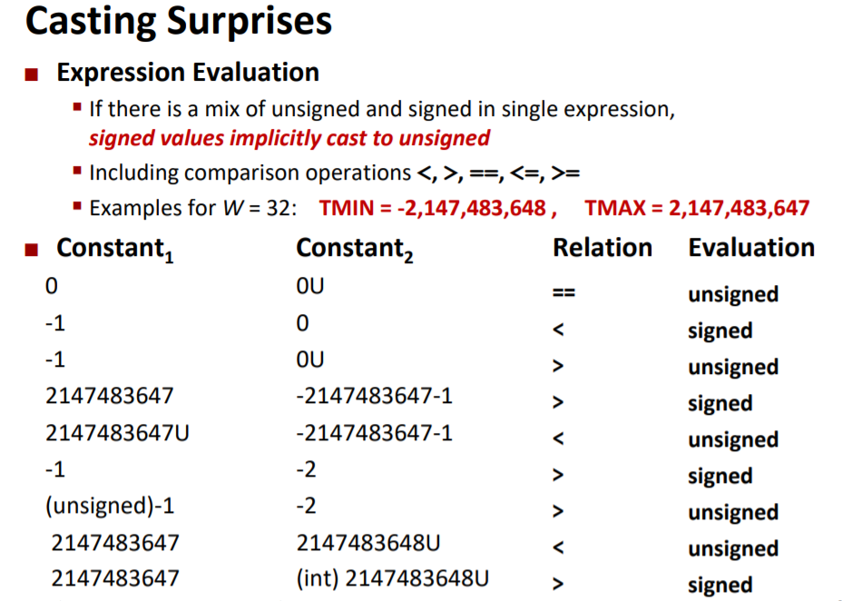
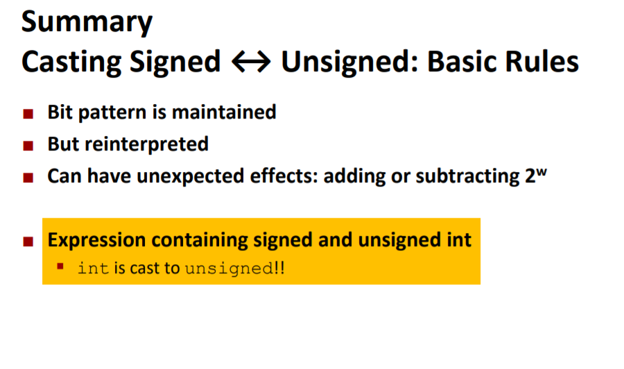
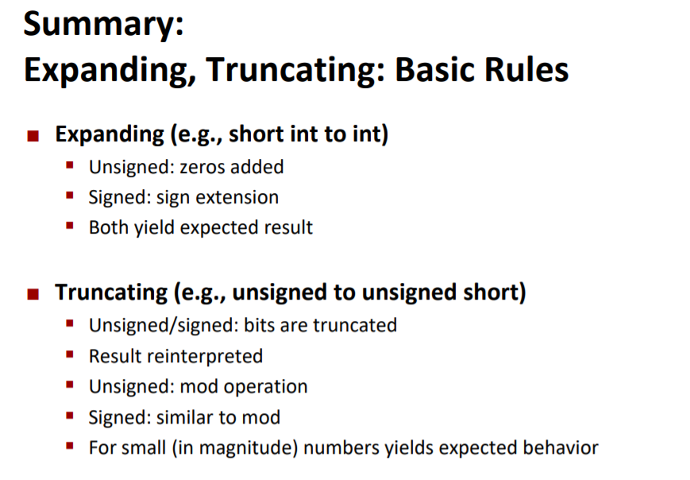
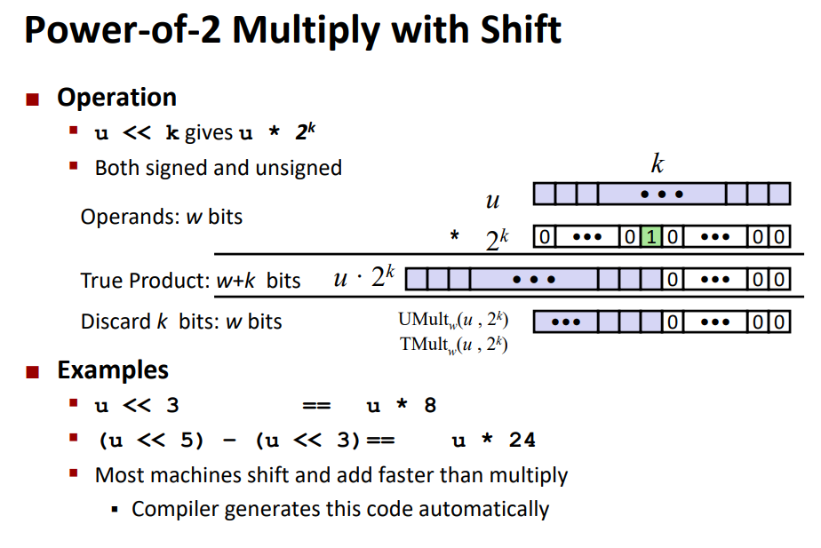
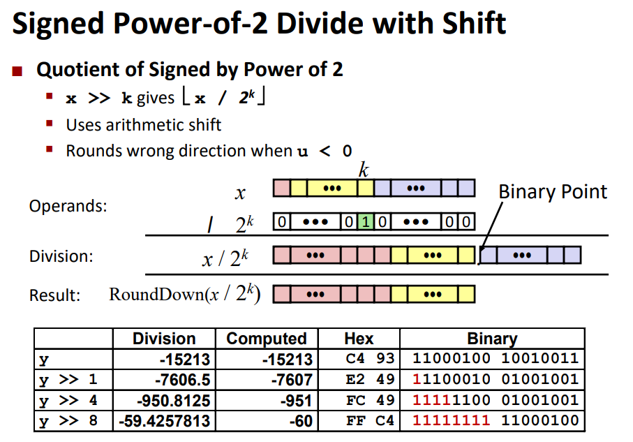
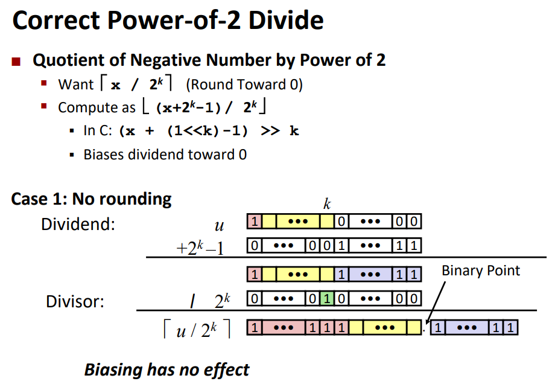
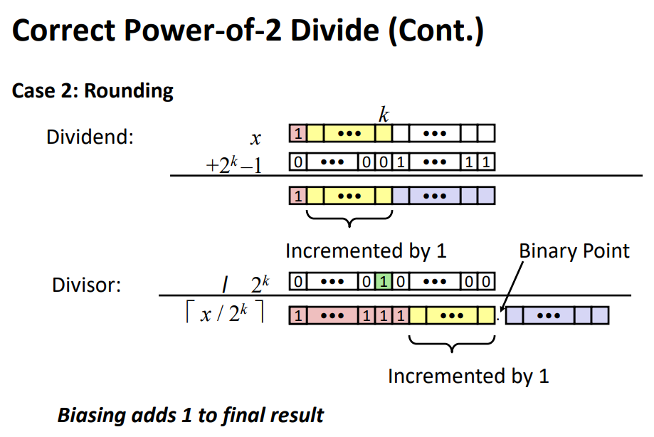
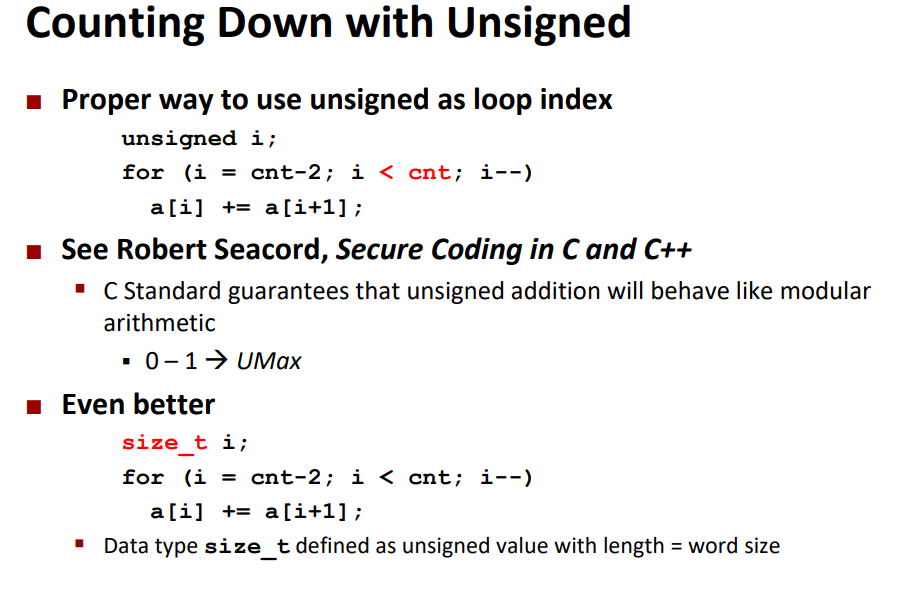
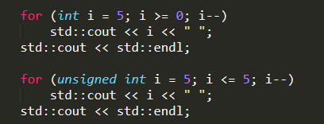

## Bits, Bytes and Integers

slides02, 03

### Representing information as bits

bit & byte

### Bit-level manipulations

四个位操作：与，或，非，异或。

C中这四个按位操作：&, |, ~, ^。与C中逻辑操作对比：&&, ||, !，逻辑操作只返回0/1，只要数值不是0就是true。

移位操作：<<左移，右补0；>>右移，逻辑移位左补0，算术移位左补最高位。

### Integers

two‘s complement：补码，表示范围。

unsigned integer与signed integer之间的转换，也即原码与补码的转换。

#### C中Signed和Unsigned的casting

若语句里同时有signed和unsigned，将signed隐式转换为unsigned，比如比较语句`<, >, ==, <=, >=`（C中数字后带U表示为unsigned）:

casting规则：

二进制数字不变，解释规则改变，若同时有unsigned int，将int解释为unsigned int。

#### Expanding & Truncating

有符号数扩展，左扩展位全部填充符号位。

有符号数截取，直接截去最高k位（包括符号位），结果可能改变，相当于做mod模运算。

C中的求模%是按照`a/b = n...r, a = b * n + r`来的，结果可以为负，符号看被除数，可以看/src中02的代码。

#### Addition, negation, multiplication, shifting

原码和补码的加法一样，补码符号为也参与运算，有溢出直接舍弃最高位。

C中乘法实现：舍弃超出字长的位。由于计算机计算移位+求和比计算乘法快，所以实际上使用的是先移位再做求和的乘法运算：

C中除法实现：对于无符号数采用移位除法是正确的，但是对于有符号数，移位除法计算结果不是我们熟悉的**向0取整**：

`-15213 / 2^8`应为-59，而用移位计算是-60，因此若想**对负数（正数是正确的）**实现向0取整（Round to 0）的移位除法，需要如下操作：

在移位除法时加上`2^k - 1`，或表示为`(x + (1 << k) - 1) >> k`，也就是为被除数低k位加上111..1的bias。case1是没有取整的情况，即被除数最低k位都为0，此时bias没有作用；case2的被除数最低k位不为0，则加上bias后一定会向第k位进1（加上bias后的最低k位是什么不重要，最后取整时会被舍去），这样计算的结果就增大1，就是向0取整的了。

取反：取反再+1，因而对于补码x，有~x + x = -1。

#### C中用unsigned作为index的正确姿势

使用unsigned int作为index，在循环中使用>=0作为循环条件会导致无限循环，而用i < limit作为条件就很好：

### Representations in memory, pointers, strings

#### Byte Ordering

Big Endian：大端模式，Least significant byte has highest address，即最低位**字节**放在最后，也就是最高地址，符合正常阅读顺序。Little Endian小端模式，相反，最低位字节先存放。

#### Representing Strings

每个char都是1个字节，因此不存在大端小端的问题。

C中char必须以null结尾，因此要多一个大小。