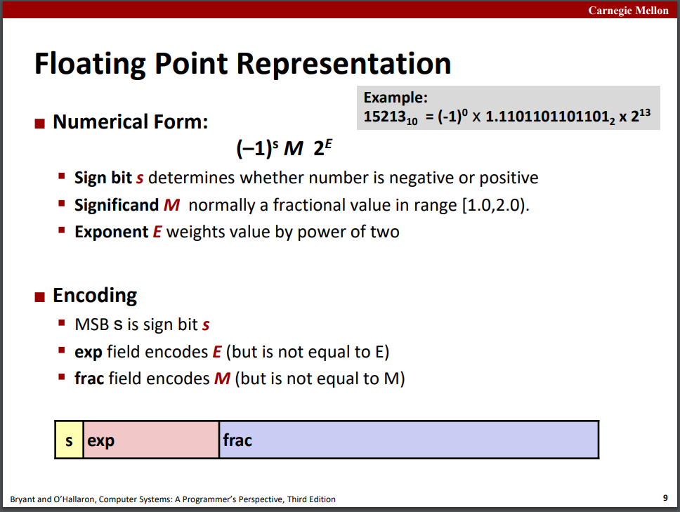
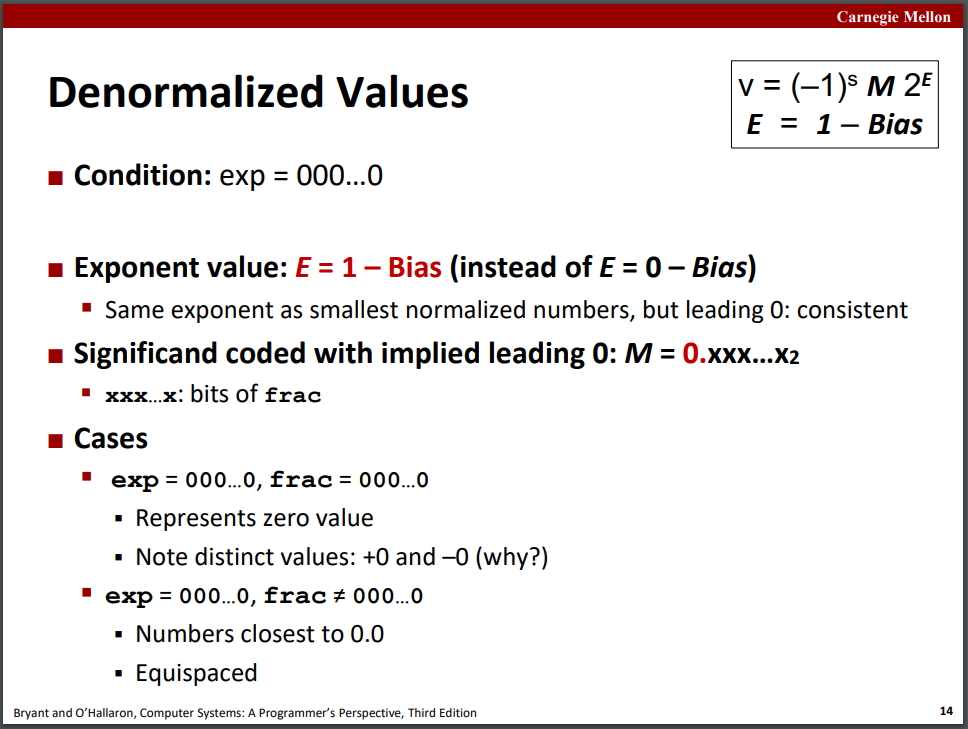
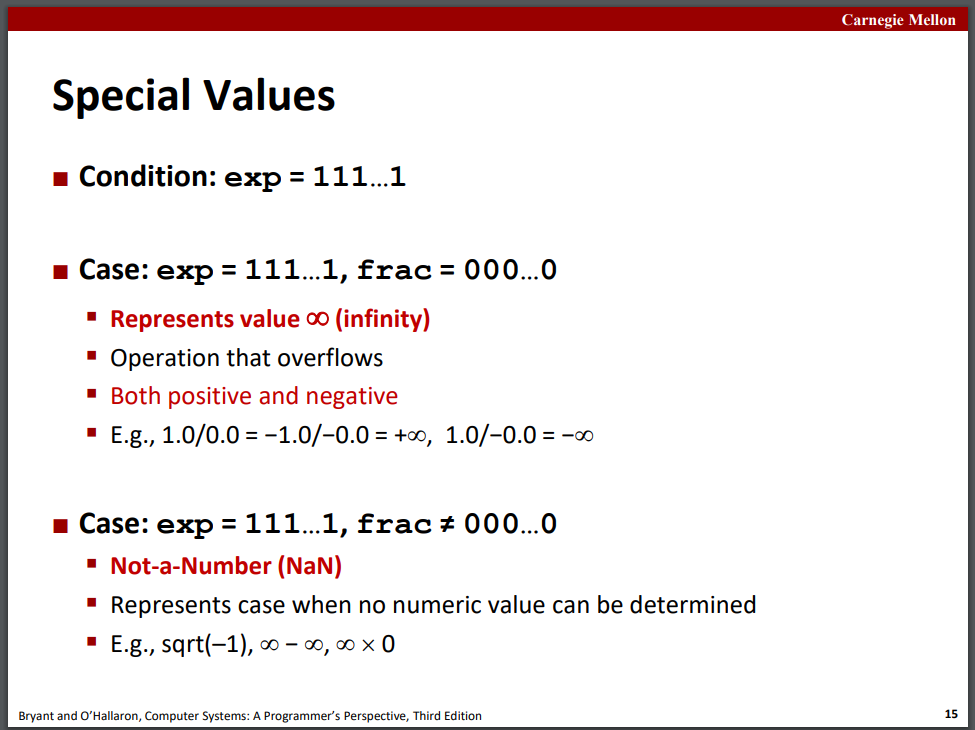
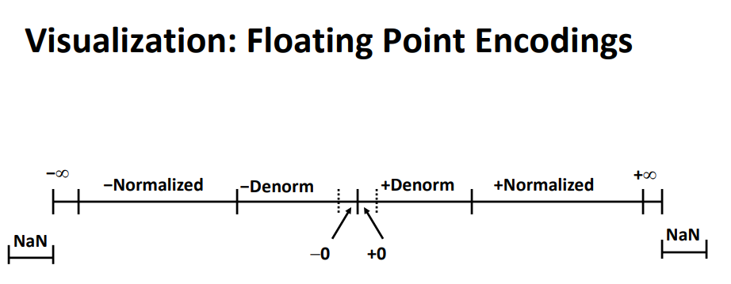
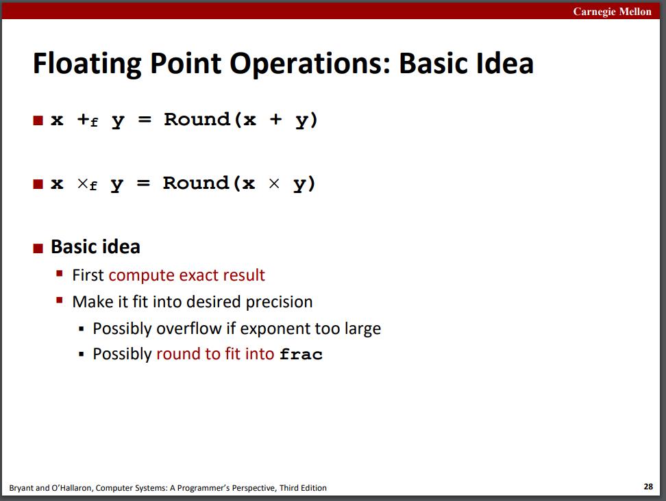
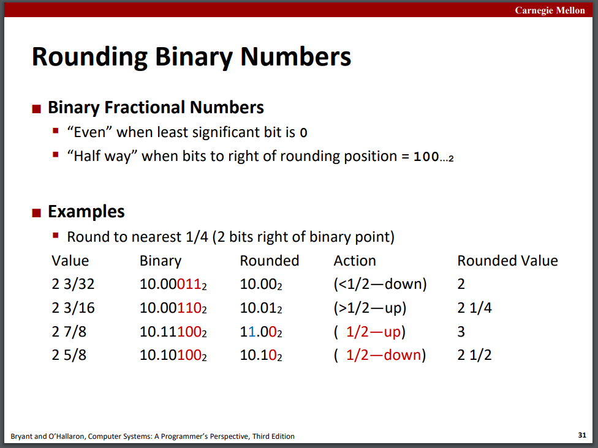
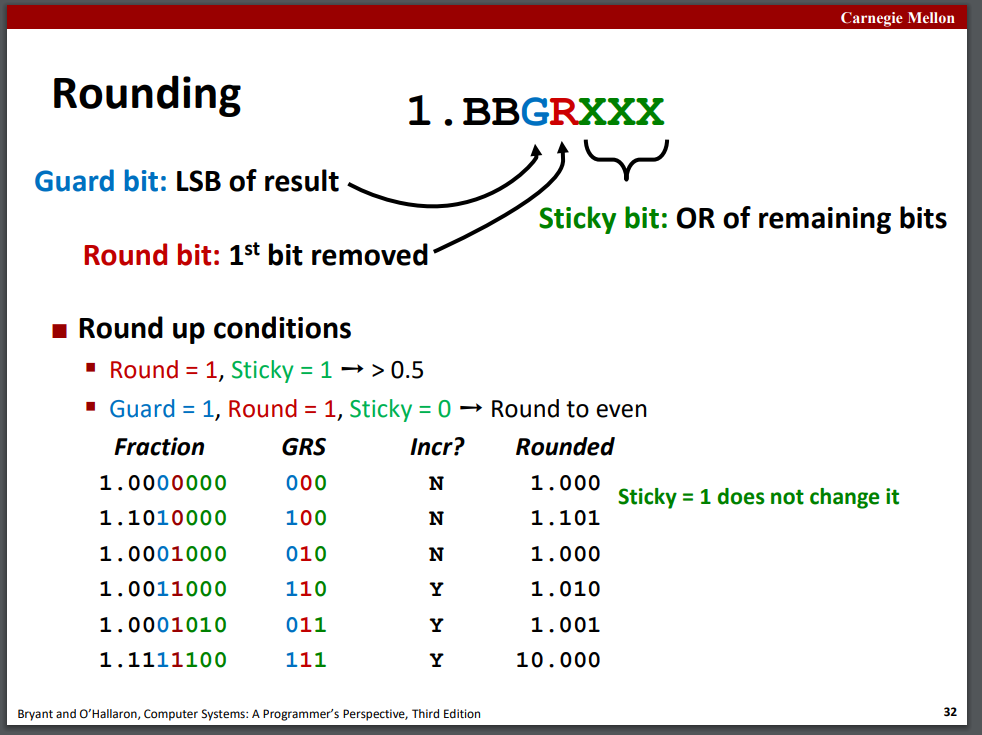
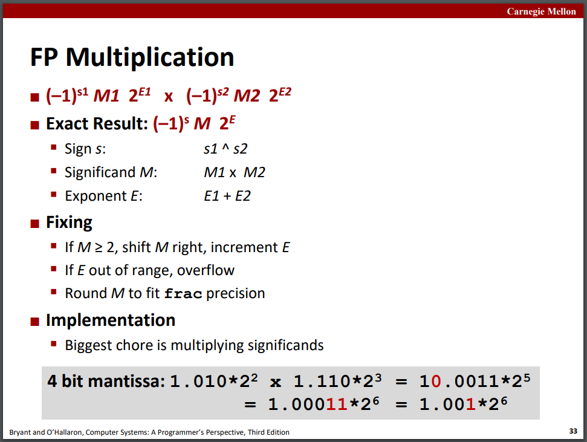
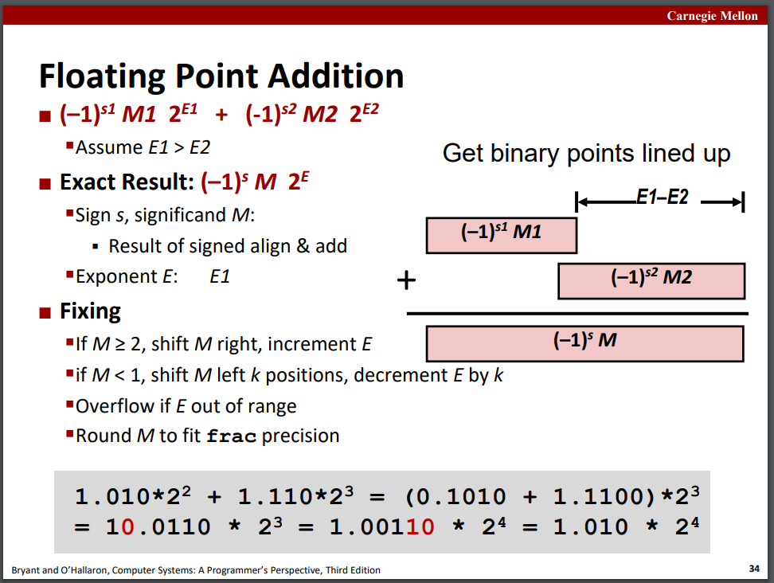
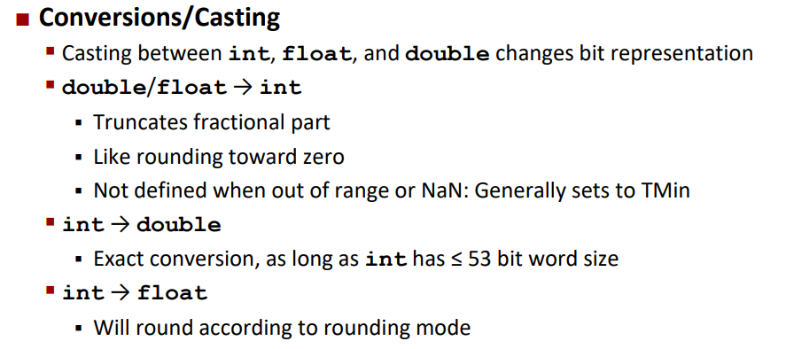

## Floating Point

slides04

### Background: Fractional binary numbers 

二进制定点小数只能表示形如`x/2^k`的小数，其他形式会有无限循环的位。

### IEEE floating point standard: Definition 

IEEE 754标准。

根据E阶码的不同，有三种格式：

#### Normalized规格化

exp不能为000..0或111..1，用移码表示，E = Exp – Bias。

M尾数有隐含位1。

#### Denormalized非规格化

阶码为000..0。其中E = 1 – Bias，不是0；M没有隐含位1。

尾数为0时表示0（也是非规格化数）；其余情况表示的是非规格化的浮点数，是有数值的。

#### Special特殊值

阶码为111..1。

尾数为0时表示无穷大；其余情况表示NaN。

### Example and properties 

### Rounding, addition, multiplication 

因此浮点数运算的规则是：**先计算结果（不考虑位数是否够用），再进行rounding舍入**。

#### Rounding

IEEE754采用的是round-to-even/nearest even，即向最近的偶数舍入。当小数距离舍入是否进位的结果距离不同时，选择距离近的那个，距离相同时，向偶数舍入（**使最低有效位为0**）：

可见若round位为1，sticky位都为0，就是距离相同的情况（0.5）；若round为1且sticky不为0，就是向上舍入近的情况（>0.5）。

#### Multiplication

先计算，再规格化，最后看是否需要舍入或溢出。

乘法满足交换律但不满足结合律和分配律。

#### Addition

先对阶（统一化为阶数大的），化为数字计算结果，再规格化（依然按照前述浮点数运算规则）。

加法满足交换律但不满足结合律。

### Floating point in C

casting。float/double转int直接丢掉全部小数位，int转float/double可能会需要舍入：

