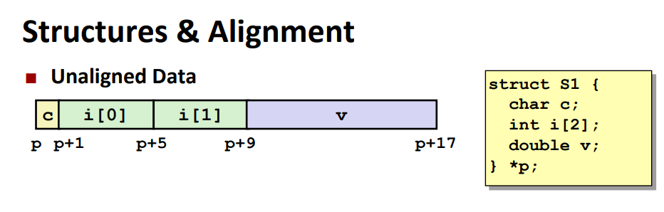
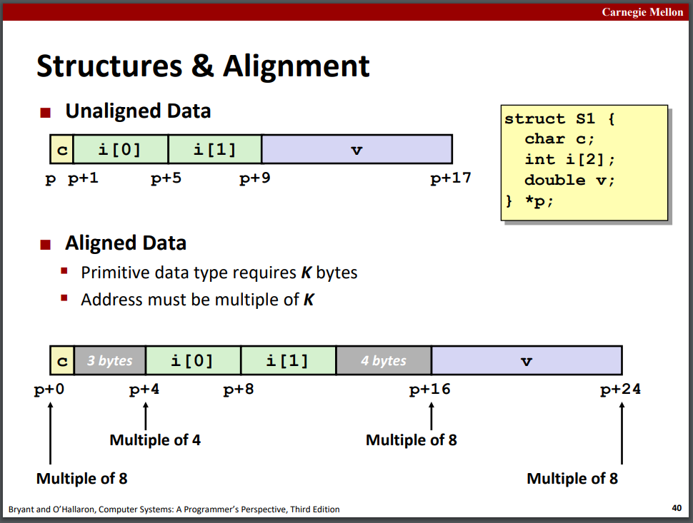
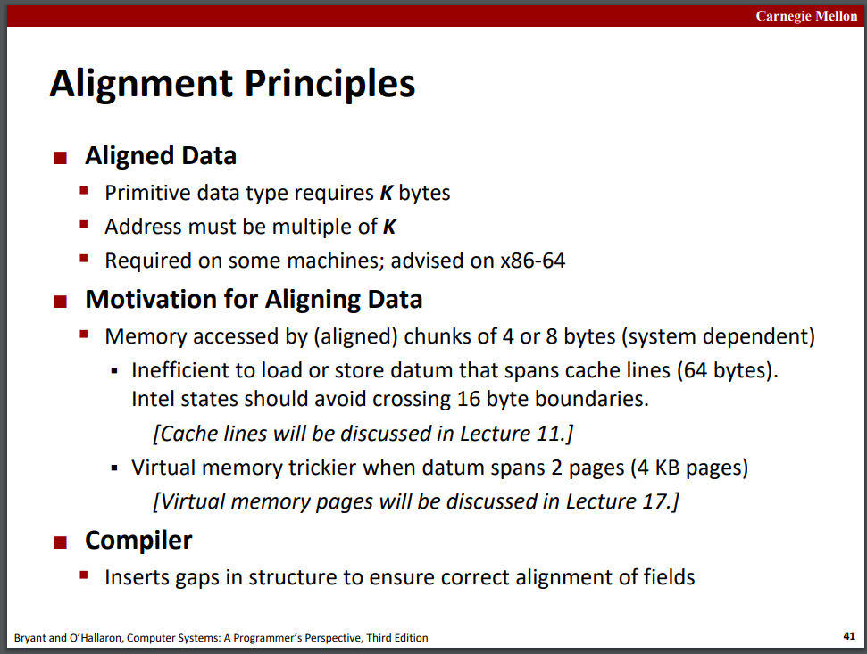
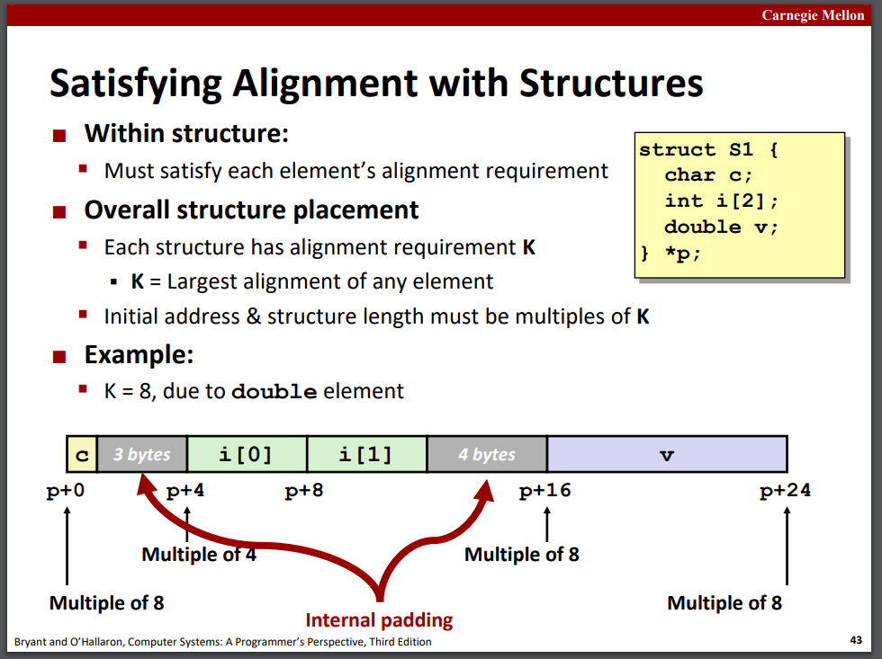
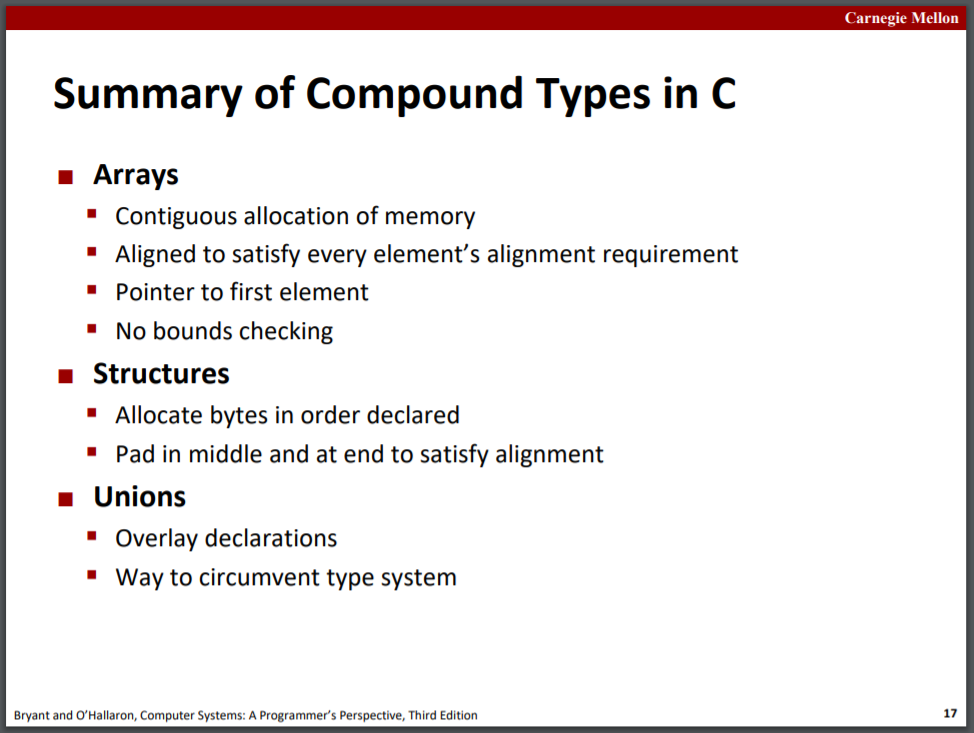
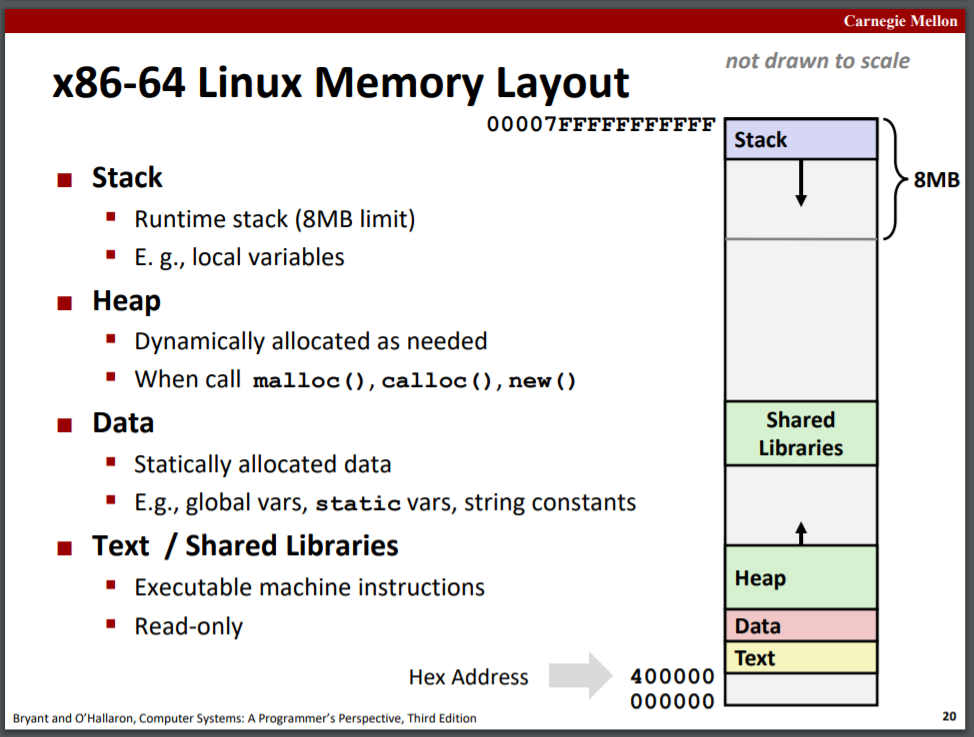

## Machine-Level Programming

slides05，06，07，08，09

### Basics

#### Assembly Basics: Registers, operands, move

#### C, assembly, machine code

汇编指令的长度不同，但在编译后的obj中都是二进制字节。

### Control

### Procedures

### Data

#### Arrays

数组在内存中顺序存放占据连续的空间，二维数组亦同。区分数组指针和指针数组。

#### Structures

结构体在内存中也占据连续空间，内部按structure的声明顺序放置。

**Alignment内存对齐**：未对齐的结构体直接连续存放，而进行内存对齐的结构体会在变量中添加空隙：

规则如下，structure内部元素地址要能被对应基本类型（Primitive data type）的长度整除，即int的地址要能被4整除，double的地址要能被8整除；且structure整体地址和总体长度都要能被其中最大类型长度整除：

C中的结构体会自动满足alignment，因此sizeof返回的值是对齐后的结构体大小，可见src/08-test.cpp，且C会自动在struct起始地址不满足整体alignment要求时在内存前方添加空隙。

因而为了节省内存可以把struct中的大元素放在前面。

#### Unions

union共同体的所有成员共用同一段内存，大小为最长的成员大小。

### Advanced Topics

#### Memory Layout

#### Buffer Overflow

栈溢出，代码注入攻击就是利用这一点，将可执行代码通过字符串放入栈中执行。

