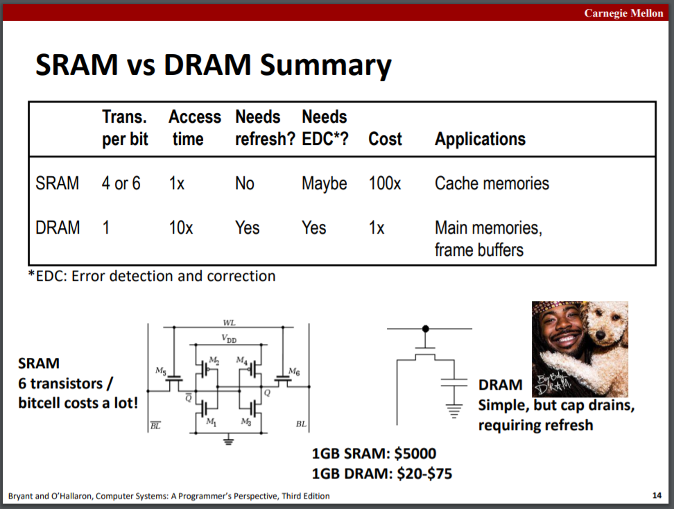

# The Memory Hierarchy

slides11，12

## Storage technologies and trends

RAM:
* RAM is traditionally packaged as a chip.
* Basic storage unit is normally a cell (one bit per cell). 最基本单位是单元，只有一位。
* Multiple RAM chips form a memory.

SRAM vs DRAM:



DDR4，DDR3是Double data-rate synchronous DRAM，强化的DRAM。

SRAM和DRAM是volatile memories易失存储器，Nonvolatile memories非易失存储器。

磁盘存储：结构，时间计算。

## Locality of reference

局部性原则。

## Caching in the memory hierarchy

Big Idea (Ideal): The memory hierarchy creates a large pool of storage that costs as much as the cheap storage near the bottom, but that serves data to programs at the rate of the fast storage near the top. “下层的容量，上层的速度”。

三种cache缺失：
* Cold (compulsory) miss：cache首次启动，为空
* Capacity miss：要用到的块比cache块大
* Conflict miss：存放位置冲突

### Cache memory organization and operation

结构，读写操作，计算。

### Performance impact of caches

The memory mountain：[存储器山](https://zh.wikipedia.org/wiki/%E5%AD%98%E5%82%A8%E5%99%A8%E5%B1%B1)，可以用函数测试存储器山的性能，指导程序优化。
 
### Rearranging loops to improve spatial locality

对于矩阵乘法，采用不同的循环顺序有不同的cache缺失率。假设一个cache块能放入4个矩阵元素，矩阵维数足够大，此时访问一维数组的cache缺失率为25%，分析不同的循环顺序带来的运行效率。

对于常用的ijk循环顺序（jik分析结果相同）：

```c
/* ijk */
for (i=0; i<n; i++) {
  for (j=0; j<n; j++) {
    sum = 0.0;
    for (k=0; k<n; k++)
      sum += a[i][k] * b[k][j]; // tag
    c[i][j] = sum;
  }
}
```

代码每次循环读内存2次，写内存1次（课件里是0次写，不知为何）。由于c矩阵的访问必然会造成cache缺失，这里的分析和计算就只考虑最内层循环的访存语句（tag标记的语句），后面的情况也是这样。当i和j固定时，即只遍历k一遍，cache平均缺失次数为`1 * 0.25 + 1 * 1.00 = 1.25`。

若采用kij的循环顺序：

```c
/* kij */
for (k=0; k<n; k++) {
  for (i=0; i<n; i++) {
    r = a[i][k];
    for (j=0; j<n; j++)
      c[i][j] += r * b[k][j]; // tag
  }
}
```

程序每次遍历读内存2次，写内存1次。k和i固定时，tag语句每次执行的cache平均缺失次数为`1 * 0.25 + 1 * 0.25 = 0.5`。

采用jki顺序：

```c
/* jki */
for (j=0; j<n; j++) {
  for (k=0; k<n; k++) {
    r = b[k][j];
    for (i=0; i<n; i++)
      c[i][j] += a[i][k] * r; // tag
  }
}
```

程序每次执行读内存2次，写内存1次。j和k固定时，tag语句执行的cache平均缺失次数为`1 * 1.00 + 1 * 1.00 = 2`。

由此可见循环语句的次序不同，会带来不同的运行效率，而这里利用的就是程序的**spatial locality空间局部性**，连续二维数组的第二维以减少开销。

### Using blocking to improve temporal locality

依然是矩阵乘法，分析最内层循环的cache缺失情况，假设每一个cache块可以存储8个double元素，矩阵宽度n足够大，cache可以放下大于3个块。

如下代码：

```c
c = (double *) calloc(sizeof(double), n*n);
/* Multiply n x n matrices a and b */
void mmm(double *a, double *b, double *c, int n) {
  int i, j, k;
  for (i = 0; i < n; i++)
    for (j = 0; j < n; j++)
      for (k = 0; k < n; k++)
        c[i*n + j] += a[i*n + k] * b[k*n + j]; // tag
}
```

对于最内层计算乘积的语句，访问a的缺失次率1 / 8，访问b的缺失率为1，最内循环执行一次tag语句的cache缺失次数为`n / 8 + n = 9 * n / 8`，运行程序总cache缺失次数为`9 * n / 8 * n^2 = (9 / 8) * n^3`（访问c每次都缺失，都不计算）。

若将矩阵乘法修改为以下按块进行计算的代码：

```c
c = (double *) calloc(sizeof(double), n*n);
/* Multiply n x n matrices a and b */
void mmm(double *a, double *b, double *c, int n) {
  int i, j, k;
  for (i = 0; i < n; i+=B)
    for (j = 0; j < n; j+=B)
      for (k = 0; k < n; k+=B)
        /* B x B mini matrix multiplications */
        for (i1 = i; i1 < i+B; i++)
          for (j1 = j; j1 < j+B; j++)
            for (k1 = k; k1 < k+B; k++)
              c[i1*n+j1] += a[i1*n + k1]*b[k1*n + j1];
}
```

B为按块计算的块宽度（cache块的宽度依然为8），则访问a或b的每一块缺失率为1/8，计算c的一块的cache缺失次数为`B^2 * 1 / 8 = B^2 / 8`，运行程序总的cache缺失数为`B^2 / 8 * 2 * n / B = n * B / 4`。

若采用B = 8，总缺失次数为2n次，而第一个程序为8/9 * n^3次，大大减少了缺失次数，这里利用了程序的**temporal locality时间局部性**，连续访问刚从内存放入cache的块以减少开销。

**从这两个代码例子中可以很好的区分空间局部性和时间局部性**：
* Try to maximize spatial locality by reading data objects sequentially with stride 1. 连续访问连续存放的数据。
* Try to maximize temporal locality by using a data object as often as possible once it’s read from memory. 连续访问刚从内存取出放入cache的数据。
