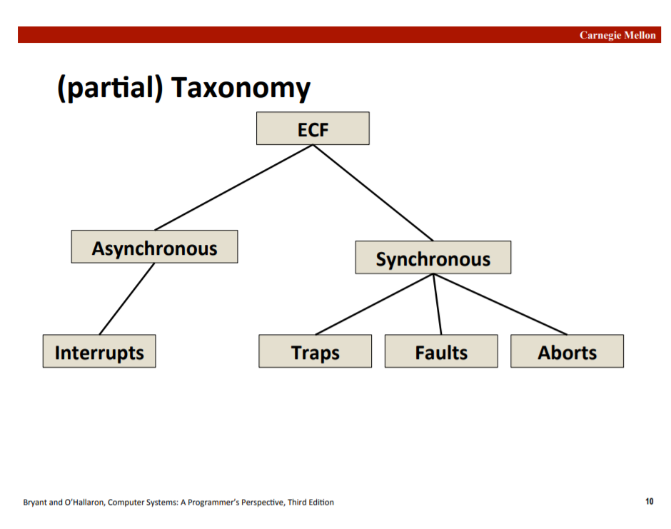
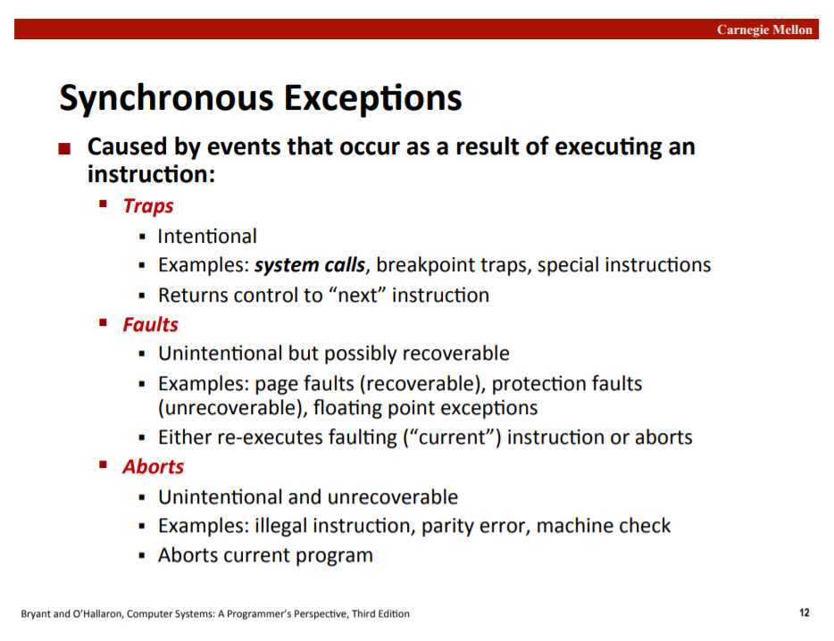
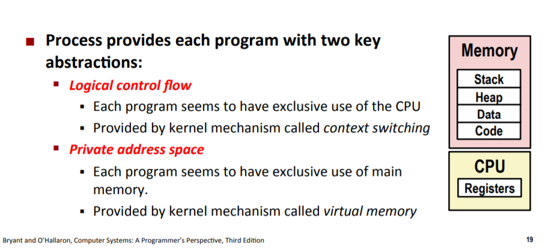
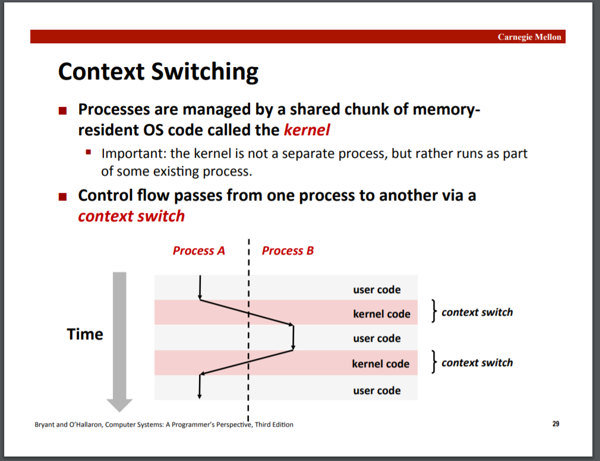
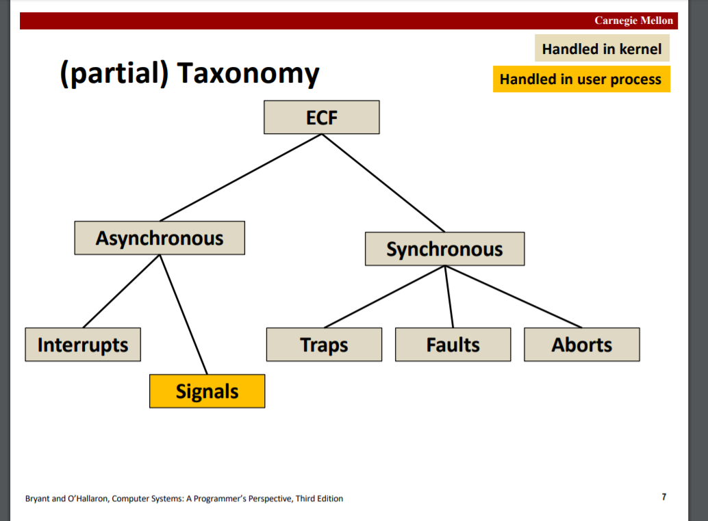

# Linking

slides13

## Linking

static linking

dynamic linking

## Case study: Library interpositioning

库插入，可以写自己的库供程序链接，可以起到不打断点debug的功能。

---

# Exceptional Control Flow

slides14，15

## Exceptional Control Flow

异常控制机制存在于计算机的多个层级中。低级别的是Exceptions，高级别的有Process context switch，Signals，Nonlocal jumps。

## Exceptions

异常将控制权从用户代码转移到系统内核，即异常操作都是由kernel执行的。

同步ECF是中断。

异步ECF有：
* Traps陷阱：主动/故意进行的，有系统调用，特殊指令，断点等。
* Faults故障：非主动进行，可能可恢复，有页错误，浮点数异常等。
* Aborts终止：非主动进行，不可恢复，会终止当前程序，有非法指令，非法内存访问等。

## Processes

进程，A process is an instance of a running program.

进程为程序提供两大抽象：
* Logical control flow，CPU使用权，通过context switching实现
* Private address space，内存空间，通过virtual memory实现

### Context Switching

context switching完成两个进程间的转换，先从user code1转换到kernel code，再转换到user code2。kernel是操作系统的一个核心部分，但不是独立的进程，它存在于一些现有进程中：

## Process Control

### Terminating Processes

一个进程被terminated终止有三种情况：
* 收到终止信号
* return：从主函数返回
* exit：`exit(int status)`，带有一个exit状态，exit只被调用不会再return

### Creating Processes

通过`fork()`创建子进程，子进程会获得父进程虚拟地址空间的拷贝，文件描述符（共享打开的文件），和新的进程号pid。

fork函数调用一次，返回两次，在子进程中返回0，父进程中返回子进程的pid。见可见中的示例代码，子进程有同样的变量，但不会和父进程互相影响，且父子进程并行执行。

另外还有指令（都是Linux的）：`wait()`等待子进程，`execve()`调用和执行进程。

## Shells

A shell is an application program that runs programs on behalf of the user. Shell是unix系统下传统的用户和计算机的交互界面，即命令行。

## Signals

A signal is a small message that notifies a process that an event of some type has occurred in the system. 信号机制提供进程级的异常处理。

signals是由kernel发给进程的。

信号发出还未被接收时的状态叫pending，进程也可以block信号，kernel为每个进程维护一个pending位和block位。

可以自定义signal handler来控制信号处理。

## Nonlocal jumps

Nonlocal jumps机制提供进程内的异常处理。

`setjmp`存储当前进程的PC，`longjmp`读取存储的程序地址，实现跳转功能。
