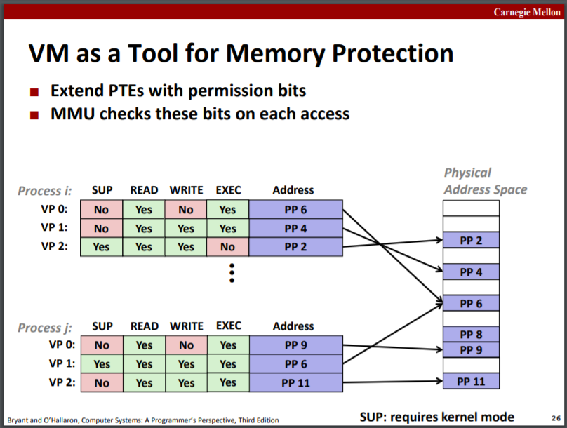

# System-Level I/O

slides16

---

# Virtual Memory: Concepts

slides17

## Address spaces

CPU通过MMU访问内存。

## VM as a Tool for Caching

虚拟内存系统可以视为将主存作为cache，即DRAM cache。从这个角度来看，VM命中时采用的策略是write-back写回法。

Working set工作集：At any point in time, programs tend to access a set of active virtual pages called the working set。

Thrashing抖动：工作集大小大于主存大小，导致页不断换入换出，性能下降。

Page table页表：A page table is an array of page table entries (PTEs) that maps virtual pages to physical pages.

## VM as a tool for memory management

每个进程的内存的虚拟地址独立，虚页可以映射到任意的实页。

## VM as a tool for memory protection

PTE维护允许位以在每次访问时控制页的读写权限。

## Address translation

# Virtual Memory: Systems

slides18