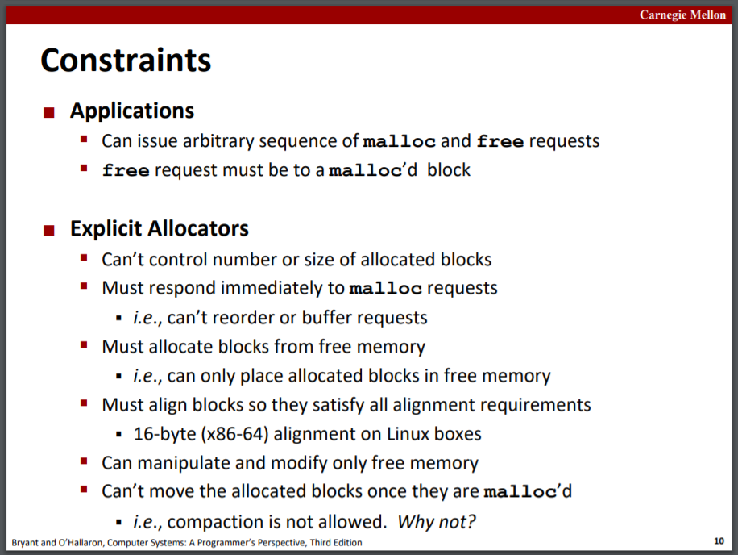

# Dynamic Memory Allocation

slides19，20

## Basic concepts

程序员通过如`malloc`的Dynamic memory allocators在运行时获取虚拟内存，它们管理虚拟内存中的heap堆，共有两种allocators：
* explicit allocator：分配空间并释放空间，如`malloc`和`free`。
* implicit allocator：分配空间但不释放空间，如`new`和Java中的垃圾回收机制。

堆中的内存有两种状态：allocated和free。

### malloc

`void *malloc(size_t size)`返回至少size_t大小的内存的指针（内存大小会进行align）

`void free(void* p)`中的p必须是被malloc或realloc创建的内存指针。

`realloc`修改之前分配好内存块的大小。

内部碎片和外部碎片。

## Implicit free lists

隐式释放表，每一块存储块长，将所有块相连，将allocated/free位存在size字的低位。

Placement policy，Splitting policy，Coalescing policy。

## Explicit free lists

显示释放表，将所有free blocks用指针相连。

## Segregated free lists

每一种大小的块都有自己的free list

## Garbage collection

垃圾回收，有多种算法。

Mark and Sweep Collecting：遍历所有块，对经过的块标记mark位，最后未被标记的块就是free block

## Memory-related perils and pitfalls

C中常见的内存错误。

## Malloc vs New

区分C中的malloc/free和C++中常用的new/delete。

[https://www.cnblogs.com/QG-whz/p/5140930.html](https://www.cnblogs.com/QG-whz/p/5140930.html)

malloc需指定内存大小，new会隐式计算；

malloc内存分配在堆，new分配在自由存储区；

malloc返回void*，new返回类型指针；
