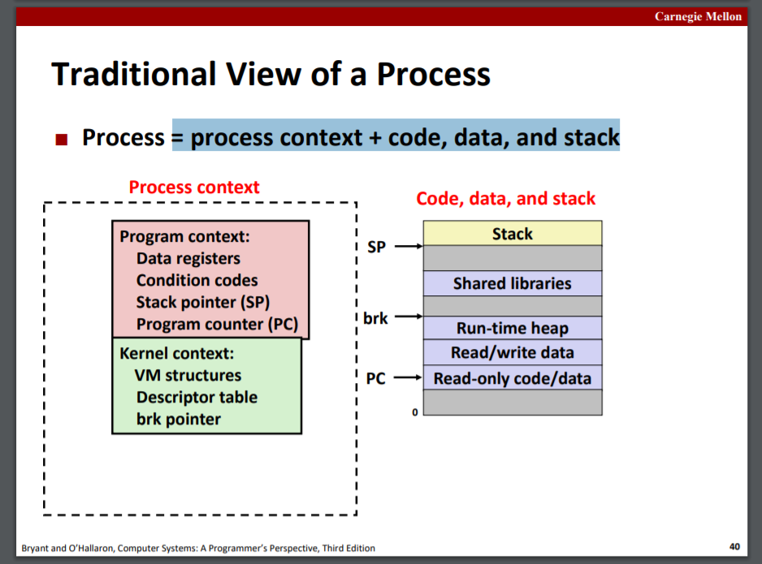

# Concurrent Programming

slides23

以网络服务器角度讲解并行：
* process-based server
* event-based server
* thread-based server

**process = process context + code, data, and stack**

---

# Synchronization

slides24, 25

sharing，mutual exclusion,  semaphores

deadlock,  thread safety

---

# Thread-Level Parallelism

slides26

## Parallel Computing Hardware

multicore

Hyperthreading超线程：在CPU内重复必要的硬件，实现多线程并行

## Thread-Level Parallelism

### Cache Coherence

cache一致性。多处理器并行时，会有多个cache，这就会带来cache中映射同一主存块的内容不一致的问题。

### Sequential Consistency（SC）

内存一致性的一个模型，课件好像没讲完，要求顺序执行，一起错一起对。