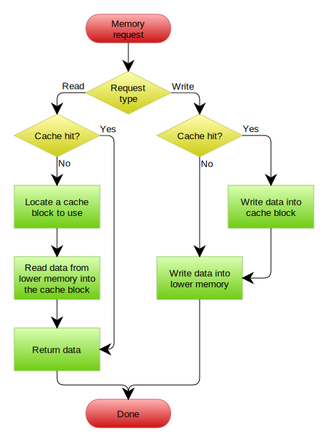

* “王道”指王道2020计组复习指导
* “课本”指《计算机组成与设计 软件/硬件接口》
* “唐的课本”指《计算机组成原理》第二版，唐朔飞

## 计算机系统概述

### 发展历程

### 层次结构

冯诺依曼结构，以运算器为中心，存储程序。

现代结构，以存储器为中心。

**MAR和MDR**：MAR存储地址，长度和存储单元个数有关（等于PC）；MDR存储数据，长度等于存储字长。**MAR和MDR属于存储器，但都存在于CPU中**。不论是访存取指令还是数据，都是先将地址传给MAR，访存取出内容放入MDR，结合指令执行过程的数据通路理解。

王道P8选择题1，结构图。控制器和运算器组成CPU，再加上存储器就组成了主机。

### 性能指标

**机器的32位/64位：机器字长，指计算机进行一次整数运算能处理的二进制数据的位数。一般等于内部寄存器的大小**。王道P22，与指令字长和存储字长的区别。

CPI, MIPS。

王道P22，透明性。

## 数据的表示和运算

### 数制与编码

C中二进制`0b`，八进制`0`，十六进制`0x`。

#### 不同进制相互转换

二进制转八进制/十六进制：将每3位（十六进制为4位）二进制数转换成一个八进制数。

十进制转换为其它进制数：整数部分用**除基取余法**，小数部分用**乘基取整法**。

BCD码：Binary-Coded Decimal，二进制编码的十进制数。常用8421码，拿8421码运算时得到大于`1011`时需要加6修正。

大端模式，小端模式：详见CMU课件note1。

边界对齐：CMU课件note1，其实是一种空间换时间的思想，适应指令流水线。

#### 校验码

校验码是能发现或自动纠正错误的数据编码，也叫检错纠错码。原理是通过在原数据码上增加冗余码来达到检错/纠错。

码距：任意两个合法码字之间最少变化的二进制位数（位数，不是差值）。码距>=2时，校验码开始具有检错能力（显而易见）。码距越大，检错、纠错能力越强，且检错能力总是大于纠错能力。

**奇偶校验码**：1位校验位，码距为2，可以检测出奇数位错误（奇数个错误），无法确定错误位置，无法纠正错误。奇校验，偶校验。

**海明码**：默认的，基本的海明码可以检测并纠正1位错误，不论是数据位还是校验位。使用步骤：确定位数（使用`n + k <= 2^k - 1`就限制了这个海明码是只能检测1位的基本海明码） - 确定校验位的位置 - 分组 - 校验位取值 - 校验。

**CRC码**：可以检测并纠正1位错误。使用步骤：生成多项式G的最高次幂为校验位R的位数 - 原信息码左移R位 - **模2除**得到R位余数作为校验位 - 校验。

### 定点数

原码，反码，补码，移码：参考王道，课本P223。

补码大小比较：规则是，符号位相同，数值越大，码值越大。王道P49的21-24题。

#### 定点数移位运算

算术移位：符号位不动，补0或补1，规则是王道P39的表2.1。

逻辑移位：全部移动，全部补0。

循环移位：分为带进位标志位和不带进位标志位。

#### 定点数加减法运算

减法运算将减数取反，化为加法运算。

**无符号数减法运算**：王道P219第7题第3问。
```
规则：
unsigned A - unsigned B = A + B补
借位/进位标志CF = 前一步加法的进位C XOR 1
A - B = A + (2^n - 1 - B + 1) = A - B + 2^n = A + B补
// https://www.zhihu.com/question/51493338
```


补码运算溢出判断：看双符号位/进位。

#### 定点数乘除运算

课本P222。

原码一位乘法：符号位单独计算，相当于普通乘法，看被乘数最低位，若为1则结果加乘数并右移。

补码一位乘法（Booth算法）：符号位参与运算，将二进制数拆开化简以减少加法运算次数。

原码除法（不恢复余数法）：符号位单独运算。

补码除法（加减交替法）：符号位参与运算。

**强制类型转换**：见CMU课件note1。C中隐式类型转换的规则是向上提升，即运算时将所有操作数隐式转换为其中最高的类型。

### 浮点数

CMU课件note2。

规格化：看尾数，原码和补码的规则不同，王道P64。尾数溢出时右归，其它格式不合规则都左归。

溢出：看规格化后的阶码是否溢出。

### ALU

一位全加器：和表达式，进位表达式。

并行加法器：G和P的公式。

## 存储系统

### 存储器的分类

按存取方式分类：
* RAM随机存取存储器，断电信息消失（易失性存储器），SRAM做cache，DRAM做主存。
* ROM只读存储器，非易失性存储器。广义上有些派生的ROM存储器已可以写入。
* 串行访问存储器，访问时需按物理位置先后顺序寻址，包括磁盘（DAM直接存取存储器）和磁带（顺序存取存储器）。

### 半导体随机存储器

半导体存储芯片有**读写控制线，片选线，地址线，数据线**等线路，半导体随机存储器一般有SRAM和DRAM。

**引脚/线数目问题**：读写控制线2条；片选线SRAM1条，DRAM2条（行列分别选通）；地址线根据单元数计算，DRAM再乘1/2（地址复用）；数据线看单元长度。王道3.3.4的1、9、10题。

SRAM和DRAM的工作原理：王道P96。

DRAM采用**地址复用**技术，地址线是原来的1/2，地址信号分行、列传送。且DRAM需要不断刷新，有三种刷新方式：
* 集中刷新：集中对所有行依次刷新，存在“死时间”或“死区”，在死区中不能访问存储器。
* 分散刷新：把每行的刷新分散到存储器的工作周期中，工作周期的后半部分用于刷新某一行，这样没有“死区”，但加长了存取周期。
* 异步刷新：在刷新周期中均匀刷新，每隔一定时间刷新一行，存在”死时间“，但比较短。
* 透明刷新：将刷新安排在不访存的译码阶段，不会增长存取周期，也没有”死时间“。

DRAM的刷新对CPU是透明的；刷新单位是行，只需要行地址；刷新没有信息输出；所有芯片同时刷新，不需要选片。

### 主存与CPU连接

位扩展，字扩展。

### 双端口RAM和多模块存储器

都是主存的存储器类型，因此都是RAM。

#### 双端口RAM

两套独立的数据线、地址线、控制线，支持两个控制器异步访问同一单元。

#### 多模块存储器

单体多字存储器：一个存储单元存储多个字，要求指令和数据必须在存储器连续存放，否则效果不好。

多体并行存储器：高位交叉编址，本质依然是顺序存储器；低位交叉编制，交叉存储器，可用流水线存取，流水线计算（实现流水线最小模块数计算）。

### Cache

时间局部性：最近的未来用到的信息，很可能是正在使用的信息；空间局部性：最近的未来用到的信息，很可能与正在使用的信息在存储空间上是临近的。

#### Cache的基本工作原理

CPU与cache或主存以**字**为单位交换信息，cache与主存以**块**为单位交换信息。

#### Cache和主存的映射方式

主存块和cache块大小相同，主存和cache地址相同，因而进行地址映射（不同的解析方式），地址映射有三种方式：
* 直接映射：`cache块号 = 主存块号 % cache块数(主存块号 = 主存地址 / 块大小)`，地址结构为`tag + cache块地址 + 块内地址`。
* 全相联映射：地址结构为`tag + 块内地址`。
* 组相联映射：`cache组号 = 主存块号 % 组数`，地址结构为`tag + 组地址 + 块内地址`。

**计算cache总容量/总位数**：计算cache内的大小，和cache地址结构不一样，只有带**总**字才是，计算**容量**一般指计算可存数据的大小。`有效位1位 + 标记位tag + （脏位1位，只有采用写回策略才有） + 数据位（区分数据位数和地址位数`。

#### Cache写策略

命中：全写法（write-through），写回法（write-back）。

未命中：写分配法（write-allocate），非写分配法（no-write-allocate）。

命中和未命中策略的通常搭配：全写法搭配非写分配法，写回法搭配写分配法，流程图如下。




[图来自wiki](https://en.wikipedia.org/wiki/Cache_(computing))，全写法搭配非写分配法逻辑比较简单，写回法搭配写分配法每次从内存调入新块时需要判断旧cache块是否为dirty，是则要先将旧块写回内存。

### 虚拟存储器

将主存或辅存的地址空间统一编址，具有主存的速度和辅存的容量。

页式虚拟存储器：地址转换过程。页表在主存中，用于虚页号到实页号的转换。发生缺页时，是否是先从辅存调入页，再重新进行页表访问？即一共3次访存？

段式虚拟存储器：地址转换过程。段表存储程序段在主存中的物理地址和段长。

快表（TLB，Translation lookaside buffer）：页表存储与主存中，因此查页表再访存相当于两次访存，因而引入快表，快表存放于cache中。快表根据内容指定地址，一般采用**相联存储器**实现。

**有虚拟存储器和cache的存储系统的访问顺序**：王道P139。

虚拟存储器和cache的比较：王道P139。

## 指令系统

### 指令格式

基本格式：操作码 + 地址码。

根据指令字长可分为：定长指令字结构和变长指令字结构。在字节编址的机器中，字长一般都是字节的倍数。

根据操作数地址码的数目，可分为：零地址、一地址、二地址、三地址、四地址指令。

#### 操作码指令格式

定长操作码指令格式：操作码位数固定。

扩展操作码指令格式：操作码变长。短操作码不能是长码的前缀，因此n位短码的指令不能完全占用2^n条，要为长码预留，见王道P152例子。

### 指令寻址方式

#### 指令寻址

* 顺序寻址：`(PC) = (PC) + 1`（+1指增加一个指令字长）
* 跳跃寻址：修改(PC)

#### 数据寻址

A表示形式地址，EA指有效地址，(EA)指有效地址的值，即操作数。

* 隐含寻址
* 立即寻址：指令的地址字段存放的是操作数（立即数），用补码表示。
* 直接寻址：`EA = A`
* 间接寻址：`EA = (A)`，需多次访存。
* 寄存器寻址：`EA = R`
* 寄存器间接寻址：`EA = (R)`
* 相对寻址：`EA = (PC) + A`，广泛应用于转移指令。
* 基址寻址：`EA = (BR) + A`，BR是基址寄存器，程序执行时BR不变，A可变。面向操作系统，有利于多道程序设计，可用于编制浮动程序。
* 变址寻址：`EA = (IX) + A`，IX是变址寄存器，程序执行时A不变，IX可由用户改变。面向用户，适合编制循环程序，处理数组。
* 堆栈寻址：寄存器堆栈是硬堆栈，主存划分堆栈是软堆栈。SP堆栈指针是一个特定寄存器，用于给出被读/写单元的地址，即指向栈顶空单元（课后题10）。

王道P162表4.1。做题时注意要求是`有效地址EA`还是`操作数(EA)`

### CISC & RISC

CISC：X86；指令数目多；长度不固定；访存指令不受限制；大多指令需要多个周期执行；大多采用微程序控制；边界对齐不对齐都支持。

RISC：AR、MIPS架构；指令少；长度固定；只有Load/Store指令可以访存，其余指令操作在寄存器间进行，CPU中通用寄存相当多，以减少访存次数；**一定采用指令流水线技术**，大部分指令在一个周期完成；以硬布线控制为主；边界对齐。

## 中央处理器

### CPU的功能和基本结构

CPU由运算器和控制器组成。

运算器：由`ALU、暂存寄存器、ACC累加寄存器、通用寄存器组、PSW程序状态字寄存器、移位器、CT计数器等`组成。**PSW**保存各种状态信息，如溢出标志、符号标志等。

控制器：由`PC、IR、指令译码器、MAR、MDR、时序系统、微操作信号发生器等`组成。

**CPU内部寄存器的透明性**：
* 用户可见/不透明：PC、PSW、通用寄存器组。
* 用户不可见/透明：MAR、MDR、IR。

**PC和MAR位数计算**：MAR位数 = `log2(主存地址空间大小)`，而PC位数 = `log2(主存地址空间大小 / 指令字长)`，前者计算的是主存中编址单位的个数，后者计算的是主存中指令字为单位的个数。

### 指令执行过程

**指令周期**：CPU完成一条指令的时间；**机器周期/CPU周期**：通过一次总线事务访问一次主存或IO的时间；**时钟周期/节拍**：CPU操作的最基本单位。一个指令周期有若干机器周期，一个机器周期有若干时钟周期。

#### **指令周期的结构和数据流**

一个完整的指令周期包括取址，间址，执行，中断四个周期，有的指令不一定必须有全部的周期。
* 取址周期：根据PC从主存取出指令代码放入IR。王道P187步骤表和图，注意最后要完成PC+1。
* 间址周期：**取操作数的有效地址**（只是有效地址，不是取操作数）。
* 执行周期：取操作数，根据IR中操作码和操作数通过ALU产生执行结果。
* 中断周期：处理中断请求。将目前PC存入主存，加载中断服务程序的入口地址到PC中。

指令执行方案：
* 单指令周期：所有指令采用固定的执行时间，指令间串行执行。
* 多指令周期：不同指令用不同的执行时间，指令间串行执行。
* 流水线方案：并行。

### 数据通路的功能和基本结构

数据通路：数据在功能部件之间传送的路径。

数据通路的基本结构：单总线、多总线、专用数据通路。

综合题中需要熟知CPU和主存系统总线的数据通路。

### 控制器的功能和工作原理

两类控制器，描述控制器产生控制信号的方式，它们的PC和IR部分相同。

#### 硬布线控制器/组合逻辑控制器

按时间顺序发送系列控制信号。

王道P206，硬布线控制单元图，CU输入信号来源有三：指令译码器的译码信息、节拍发生器、状态标志。

硬布线的时序系统和微操作：和数据通路的综合体内容一样。

#### 微程序控制器

把每条**机器指令**转化成一段微程序，每个微程序包含若干微指令，每条微指令对应一个或几个微操作命令。

**微命令和微操作**：微操作是最基本的操作，微命令是微操作的控制信号，它们一一对应。

微命令的相容和互斥：相容性微命令可以同时产生、共同完成微操作；互斥性微命令在机器中不能同时出现。

主存在CPU外部，RAM实现（DRAM）；CM程序控制器在CPU内部，ROM实现，CM中存放微程序。

微程序控制器的组成和工作流程，可类比于指令的执行过程，王道P211。

**微程序和机器指令的对应关系**：通常是一条机器指令对应一个微程序，但有统一的取指令微程序，负责从主存中取指令并送至寄存器，也可能有间址周期和中断周期的微程序，因此微程序个数应为一一对应的微程序数加上统一的微程序数。

微指令的编码方式：
* 直接编码：n位字段对应n条微命令，0和1选择是否选用该微命令。
* 字段直接编码：把微命令字段分成小段，互斥的微命令放在同一字段，相容的放在不同字段，每个字段编码单独定义，因此长度缩短，需要译码。
* 字段间接编码/隐式编码：一个字段的微命令需要另一个字段解释。

**微指令的格式**：操作控制字段/操作码字段 + 顺序控制字段/微地址码字段。
* 水平型微指令：操作控制位 + 顺序控制位，每条可以定义执行几种并行的基本操作。直接编码、字段直接编码、字段间接编码都是水平型微指令。微指令长，微程序短，执行指令（机器指令，也就是微程序）速度快。
* 垂直型微指令：微操作码 + 目的地址 + 源地址，每条只能定义执行一种基本操作。微指令短，微程序长，执行速度慢。
* 混合型微指令：垂直型基础上加上一些并行操作。

**硬布线与微程序的比较**：王道P215表5.2。  

### 指令流水线

流水线的本质是**时间并行**。

时空图，横轴时间，纵轴空间，因此每条指令不在一行绘制。

#### 流水线的分类

#### 三种相关/冲突/冒险(Hazard)

* 结构相关/资源冲突：多条指令同一时刻竞争同一**资源（比如同时访存，同时使用寄存器）**。
* 数据相关/数据冲突：操作相同的数据。可用旁路技术解决。数据冲突共有三种：
  * RAW写后读：**正常五段流水线（取址IF - 译码/取数ID - 执行EXC - 存储器读MEM - 写回WB）只会发生这种数据冲突。**
  * WAR读后写：乱序发射时会发生。
  * WAW写后写：有多个相似功能部件时会发生。
* 控制相关/控制冲突：遇到转移指令和其他改变PC值的指令。

#### 流水线的性能指标

吞吐率：实际吞吐率，最大吞吐率（任务量无穷）。

加速比：同样的任务，不用流水线和使用流水线的时间比。实际加速比，最大加速比。

流水线的效率：占时空图的有效面积（数格子），最高效率。

#### 流水线的多发技术

超标量流水线技术：每个时钟周期内可以并发多条独立指令，通过增加硬件实现并行。

超流水线技术：在一个时钟周期内再分段，增加并行度，王道P229图。

超长指令字：多条能并行的指令组合成一条多操作码字段的超长指令字。

## 总线

### 总线概述

#### 基本概念

总线是一组能为多个部件**分时共享**的公共信息传送线路。

总线设备按对总线有无控制功能分为主设备和从设备。主设备有总线的控制权，从设备被主设备访问，只能响应主设备发来的命令。

**猝发传输/突发传输**：在一个总线周期内传输地址连续的多个数据字。在一个总线周期中，一次传输一个地址和一批地址连续的数据（由于地址连续，只需要传输一个首地址）。王道课后选择3和5。

#### 总线分类

片内总线：CPU内部总线。

系统总线：计算机各功能部件之间的总线，如CPU，主存，IO间。根据传输内容不同可分为三类：
* 数据总线：**双向总线**。
* 地址总线：指出数据总线上源数据或目的数据所在主存单元或IO端口的地址，是**单向总线**，即只能从CPU向主存或IO发送地址。
* 控制总线：传输控制信息，包括CPU送出的控制命令和主存或IO返回的反馈信号。

通信总线：计算机系统与外部系统之间传送信息的总线，也叫外部总线。

#### 系统总线的结构

单总线结构。

双总线结构：主存总线 + IO总线。

三总线结构：主存总线 + IO总线 + DMA总线。

#### 总线性能指标

* 总线传输周期/总线周期：一次总线操作的时间。
* 总线时钟周期：机器时钟周期。
* 总线工作频率/总线频率：1 / 总线周期。
* 总线时钟频率：机器时钟频率。
* 总线宽度：数据总线的根数。
* 总线带宽：总线的数据传输率，等于总线频率 * 总线宽度。
* 信号线数：地址、数据、控制线的总线数。

### 总线仲裁

总线仲裁选择主设备获得总线控制权，有集中仲裁和分布仲裁。集中仲裁的总线控制逻辑基本上集中于CPU中，分布仲裁没有中央仲裁器。

#### 集中仲裁方式

控制线：BR总线请求，BG总线允许，BS总线忙。

链式查询：
* 部件请求时通过BR线发送请求到总线控制器，若总线不忙，通过BG线发送响应信号，依次经过部件，若部件有总线请求，获得总线控制权，部件从BS线发送总线忙信号直到使用完总线。
* **3根控制线**。
* 优先级固定，对电路故障敏感。

计数器定时查询：
* 部件发请求过程相同，总线控制器收到请求并判断总线空闲后，计数器计数并通过设备地址线发往各部件，部件的计数值相同与之时获得总线控制权，然后发送BS信号。
* **log2(n) + 2 根控制线**，一根BR，一根BS，没有BG，一组设备地址线用于传输计数器的值，这里的计数器不是计算时间，是计算设备号，因此n个设备有log2(n)条设备地址线。
* 优先级灵活（若每次都从0开始计数，优先级是固定的，若每次从上一次接着计数，优先级相等，还可以由程序设置起始值）。

独立请求：
* 每个设备通过独立的BR线和BG线进行请求，总线控制器统一处理，依然由部件发出忙信号，有一根总的BS线。
* **2n + 1 根控制线**。
* 优先级灵活。

王道P254表6.1。

### 总线操作和定时

总线传输/总线周期的四个阶段：申请分配 - 寻址 - 传输 - 结束。

同步定时：统一时钟信号，速度快，逻辑简单，适用于总线长度较短和部件存取时间接近的系统。

异步定时：不互锁，半互锁，全互锁。区别：主设备撤销请求是否等待从设备回答，从设备撤销回答是否等待主设备撤销请求。 

### 总线标准

背。

## 输入/输出系统

### IO系统基本概念

IO设备通过设备控制器/IO接口与主机（总线）相连。

IO控制方式：
* 程序查询方式：CPU不断查询IO设备是否准备好。
* 程序中断方式：IO设备就绪并向CPU发出中断请求时才响应。
* DMA方式
* 通道方式：执行IO命令时，只需启动有关通道，通道将执行通道程序。

### 外部设备

磁盘：构成硬盘，磁头，柱面，扇区。

磁盘存取时间：`寻道时间 + 旋转延迟 + 传输时间`，理解结构。

RAID廉价冗余磁盘阵列：将多个独立的物理磁盘组成一个独立磁盘，主要用磁盘镜像和奇偶校验技术，RAID2有用到海明码技术。

### IO接口

主机和外设有各自的工作特点，它们在信息形式和工作速度上有很大的差异，接口是为解决这些差异而设计的。

王道P273IO接口的基本结构图，接口和主机间的数据总是并行传送的，接口和外设间有不同的传送方式。

#### **IO端口**

定义：接口电路中可被CPU直接访问的寄存器，端口 + 控制逻辑组成接口。

有数据、状态、控制端口，结合王道P273的结构图，CPU和IO接口间的总线是有方向的，CPU对数据端口（数据线）可以读写，对状态端口（状态线）只能读，对控制端口（地址线、命令线）只能写。

IO端口的编制方式：
* 统一编址/存储器映射：把IO端口当作存储器单元进行地址分配，用统一的访存指令就可以访问IO端口。
* 独立编址/IO映射：需专门的输入/输出指令访问IO端口。

### IO方式

四种IO控制方式。

#### 程序查询方式

#### 程序中断方式

中断的概念和思想：为实现CPU和IO设备并行，王道P277。

中断判优：硬件中断优先级 > 软件中断，非屏蔽中断 > 可屏蔽中断，DMA请求 > 中断请求，高速设备 > 低速设备，输入设备 > 输出设备，实时设备 > 普通设备。

**中断响应优先级和中断处理优先级**：硬件设计决定了**中断响应顺序，即中断响应优先级**，而中断屏蔽字决定了**中断服务程序完成的顺序，即中断处理优先级**，即同时来多个中断，依照硬件顺序响应，然后依照中断屏蔽字判断先是否先执行别的中断。王道P287选择题26，王道P290综合题8（若同时有多个高级的屏蔽字，直接响应最高级的？）。

**中断隐指令**：CPU响应中断后，经过某些操作转而执行中断服务程序，这些操作是由中断隐指令实现的。中断隐指令是**硬件实现**，不是真正的指令，没有操作码，不可能被用户使用。它有三个操作：关中断 - 保存断点（即PC内容） - 引出中断服务程序（取出中断服务程序入口传给PC）。

**中断向量**：中断服务程序的入口地址。中断向量表是存放中断向量的存储区，中断服务程序入口地址表。

**中断处理过程**：
* 硬件完成，即中断隐指令的3步：
  * 关中断
  * 保存断点
  * 引出中断服务程序
* 软件完成，中断服务程序执行的7步：
  * 保存现场和屏蔽字
  * 开中断
  * 执行中断服务程序
  * 关中断
  * 恢复现场和屏蔽字
  * 开中断
  * 返回

上述描述的是允许多级中断嵌套的执行步骤，若是单级中断，在“执行中断服务程序”前后没有开关中断，软件完成的一共5步，见王道P284选择题2。

#### DMA方式

主存和DMA接口之间有一条直接数据通路，发送信息不再经过CPU，但准备工作和后处理仍需CPU。

DMAC：DMA控制器，外设发送DMA请求并且CPU响应后，让出系统总线，DMAC接管CPU地址、数据、控制总线，进行数据传送，但CPU主存控制信号被禁用。

DMA请求的响应可以发生在每个机器周期结束时，不像中断请求的响应只能在执行周期后。

#### 通道控制方式

在《王道操作系统》P276，IO通道是专门负责输入/输出的处理机。